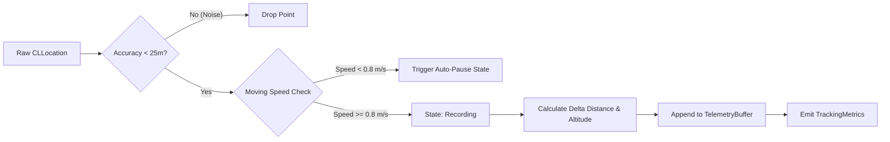

# 🏛️ StrideSync Architecture & Engineering Deep Dive

This document details the architectural design decisions, **Swift 6** concurrency patterns, memory management strategies, wireless sensor protocols, cloud database integration, and mathematical algorithms utilized in **StrideSync**.

---

## 1. Concurrency Model & Swift 6 Sendable Boundaries

A primary engineering challenge in modern high-frequency GPS tracking applications is ensuring high-rate coordinate processing does not block the UI thread (Main Thread) and remains completely free of data races.

```text
┌─────────────────────────────────────────────────────────────┐
│                    @MainActor (UI Layer)                    │
│   RecordViewModel, FeedViewModel, SwiftUI Views & Charts    │
└──────────────────────────────┬──────────────────────────────┘
                               │ (Sends Commands / Receives Snapshots)
                               ▼
┌─────────────────────────────────────────────────────────────┐
│             actor LocationEngine (Worker Thread)            │
│  - Raw GPS Ingestion                                        │
│  - Distance Accumulation (WGS 84 Geodesic)                  │
│  - Auto-Pause State Machine                                 │
│  - Elevation Gain Accumulator                               │
└──────────────────────────────┬──────────────────────────────┘
                               │ (Pure Sendable Value Types)
                               ▼
┌─────────────────────────────────────────────────────────────┐
│          TelemetrySnapshot / ActivitySummarySnapshot        │
│          (Non-mutating Sendable Structs across Actors)      │
└─────────────────────────────────────────────────────────────┘
```

### Why SwiftData `@Model` Instances Are Not Transferred Across Actors
In SwiftData, classes annotated with `@Model` are non-Sendable and bound to a specific `ModelContext`. Therefore:
1. `LocationEngine` (an `actor`) collects raw coordinate stream updates into `struct TelemetrySnapshot: Sendable`.
2. When a workout finishes (`finish()`), `LocationEngine` returns `(ActivitySummarySnapshot, [TelemetrySnapshot])`.
3. `@MainActor` or the ViewModel bound to an active `ModelContext` then instantiates `@Model WorkoutSession` entities for local database persistence.

---

## 2. GPS Telemetry Processing Pipeline

Every coordinate point received from `CLLocationManager` via delegate stream is evaluated across 4 filter stages before inclusion in workout metrics:



### 1. Accuracy Threshold Filter
Satellite signals reflecting off high-rise buildings (*urban canyon effect*) often introduce false position jumps. Points with `horizontalAccuracy > 25.0 meters` or negative values are automatically rejected.

### 2. Auto-Pause Detection
Stationary states (e.g., waiting at traffic intersections) are detected when instant velocity drops below `0.8 m/s` (approx. `2.88 km/h`). In this state, moving time timers pause automatically to maintain accurate average pace calculations.

---

## 3. Virtual Segment Matching Algorithm

A segment represents a defined street route section with a start gate (`startCoordinate`), end gate (`endCoordinate`), and ordered waypoints.

```text
   [Start Gate (R=40m)]                     [End Gate (R=40m)]
          ●                                         ●
         / \                                       / \
        /   \                                     /   \
───────(  A  )───────────────────────────────────(  B  )────────▶ (Activity Path)
        \   /                                     \   /
         \ /                                       \ /
       t_start                                   t_finish
```

### Algorithm Stages:
1. **Entry Gate Detection**: Identifies point in workout history where geodesic distance to segment start gate $\le 40\text{ meters}$.
2. **Sequential Verification**: Verifies coordinate progression moves unidirectionally along segment direction.
3. **Exit Gate Detection**: Identifies point reaching segment finish gate $\le 40\text{ meters}$.
4. **Elapsed Effort Time**: Computes time delta:
   $$\Delta t = t_{\text{finish}} - t_{\text{start}}$$
5. **KOM / PR Evaluation**: Compares $\Delta t$ against historical leaderboard records to determine new crown holders (*King of the Mountain*).

---

## 4. Geofencing Privacy Zone Algorithm

To safeguard athlete residential privacy, coordinates within privacy zone radii are sanitized:

$$\text{isInsideZone}(P) \iff \text{distance}(P, C_{\text{zone}}) \le R_{\text{zone}}$$

Points satisfying the condition above are masked or excluded from public visual map representations, while total distance calculations remain fully intact.

---

## 5. Export Standards: GPX 1.1 XML & Garmin FIT 2.0 Binary Protocol

StrideSync features dual native export engines:
- **GPX 1.1 XML**: Generates standard `<gpx>` XML documents containing `<trkpt>` nodes with elevation and timestamp attributes.
- **Garmin FIT 2.0 Binary**: Encodes data directly into binary FIT protocol format (`.fit`) adhering to Garmin Flexible and Interoperable Data Transfer specifications.
