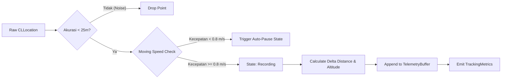

# 🏛️ StrideSync Architecture & Engineering Deep Dive

Dokumen ini menjelaskan secara rinci keputusan desain arsitektur, pola konkurensi **Swift 6**, manajemen memori, protokol komunikasi nirkabel, dan algoritma matematis yang digunakan dalam pembangunan **StrideSync v2.0+**.

---

## 1. Concurrency Model & Swift 6 Sendable Boundaries

Salah satu tantangan utama dalam aplikasi pelacak GPS modern adalah memastikan pengolahan koordinat berkecepatan tinggi tidak memblokir antarmuka pengguna (Main Thread) serta bebas dari *data race*.

```
┌─────────────────────────────────────────────────────────────┐
│                    @MainActor (UI Layer)                    │
│   RecordViewModel, FeedViewModel, SwiftUI Views & Charts    │
└──────────────────────────────┬──────────────────────────────┘
                               │ (Sends Commands / Receives Snapshots)
                               ▼
┌─────────────────────────────────────────────────────────────┐
│             actor LocationEngine (Worker Thread)            │
│  - Raw GPS Ingestion                                        │
│  - Distance Accumulation (WGS 84 Geodesic)                  │
│  - Auto-Pause State Machine                                 │
│  - Elevation Gain Accumulator                               │
└──────────────────────────────┬──────────────────────────────┘
                               │ (Pure Sendable Value Types)
                               ▼
┌─────────────────────────────────────────────────────────────┐
│          TelemetrySnapshot / ActivitySummarySnapshot        │
│          (Non-mutating Sendable Structs across Actors)      │
└─────────────────────────────────────────────────────────────┘
```

### Mengapa SwiftData `@Model` Tidak Dikirim Lintas Actor?
Dalam SwiftData, kelas yang dianotasi `@Model` bersifat non-Sendable dan terikat pada `ModelContext` tertentu. Oleh karena itu:
1. `LocationEngine` (sebuah `actor`) mengumpulkan data mentah dalam bentuk `struct TelemetrySnapshot: Sendable`.
2. Saat workout selesai (`finish()`), `LocationEngine` mengembalikan `(ActivitySummarySnapshot, [TelemetrySnapshot])`.
3. `@MainActor` atau ViewModel yang memiliki `ModelContext` aktif kemudian menginstansiasi entitas `@Model ActivityRecord` untuk disimpan ke database lokal.

---

## 2. GPS Telemetry Processing Pipeline

Setiap titik koordinat yang diterima dari `CLLocationManager` melalui delegasi dievaluasi dalam 4 tahapan filter sebelum dimasukkan ke dalam metrik latihan:



### 1. Accuracy Threshold Filter
Sinyal satelit yang memantul di antara gedung tinggi (*urban canyon effect*) sering menghasilkan lonjakan koordinat palsu. Titik dengan `horizontalAccuracy > 25.0 meter` atau bernilai negatif otomatis dieliminasi.

### 2. Auto-Pause Detection
Kondisi berhenti (misal di persimpangan lampu lalu lintas) dideteksi jika kecepatan sesaat berada di bawah ambang batas `0.8 m/s` (sekitar `2.88 km/jam`). Pada kondisi ini, timer waktu bergerak (*moving time*) dihentikan sementara sehingga nilai *average pace* atlet tetap akurat.

---

## 3. Algoritma Pencocokan Segmen (Virtual Segment Matching)

Segmen adalah potongan rute jalanan tertentu yang memiliki titik awal (*start coordinate*), titik akhir (*end coordinate*), dan daftar *waypoints*.

```
   [Start Gate (R=40m)]                     [End Gate (R=40m)]
          ●                                         ●
         / \                                       / \
        /   \                                     /   \
───────(  A  )───────────────────────────────────(  B  )────────▶ (Activity Path)
        \   /                                     \   /
         \ /                                       \ /
       t_start                                   t_finish
```

### Tahapan Algoritma:
1. **Entry Gate Detection**: Mencari titik dalam riwayat aktivitas yang jarak geodesiknya ke titik start segmen $\le 40\text{ meter}$.
2. **Sequential Verification**: Memastikan titik koordinat bergerak searah dengan segmen (bukan arah berlawanan).
3. **Exit Gate Detection**: Menemukan titik rute yang mencapai gerbang finish segmen $\le 40\text{ meter}$.
4. **Effort Elapsed Time**: Menghitung selisih waktu:
   $$\Delta t = t_{\text{finish}} - t_{\text{start}}$$
5. **KOM / PR Evaluation**: Membandingkan $\Delta t$ dengan rekor waktu sebelumnya untuk menentukan pemegang mahkota baru (*King of the Mountain*).

---

## 4. Geofencing Privacy Zone Algorithm

Untuk melindungi privasi alamat atlet, fungsi sanitasi memotong titik-titik koordinat yang berada dalam radius lingkaran privasi:

$$\text{isInsideZone}(P) \iff \text{distance}(P, C_{\text{zone}}) \le R_{\text{zone}}$$

Titik-titik yang memenuhi kondisi di atas akan disamarkan atau dihilangkan dari representasi rute visual publik, sementara kalkulasi total jarak tempuh tetap dipertahankan secara utuh.

---

## 5. Standar Ekspor/Impor GPX 1.1 XML

Layanan [`GPXService.swift`](file:///Users/mac/Downloads/swift-library/Sources/StrideSync/Services/GPXService.swift) memproduksi berkas XML yang mematuhi skema resmi [Topografix GPX 1.1](http://www.topografix.com/GPX/1/1):

```xml
<?xml version="1.0" encoding="UTF-8"?>
<gpx version="1.1" creator="StrideSync iOS" xmlns="http://www.topografix.com/GPX/1/1" xmlns:gpxtpx="http://www.garmin.com/xmlschemas/TrackPointExtension/v1">
  <metadata>
    <name>Morning 10K Tempo Run 🏃‍♂️🔥</name>
    <time>2026-08-26T07:00:00Z</time>
  </metadata>
  <trk>
    <name>Morning 10K Tempo Run 🏃‍♂️🔥</name>
    <type>Run</type>
    <trkseg>
      <trkpt lat="-6.175392" lon="106.827153">
        <ele>15.0</ele>
        <time>2026-08-26T07:00:00Z</time>
        <extensions>
          <gpxtpx:TrackPointExtension>
            <gpxtpx:hr>148</gpxtpx:hr>
          </gpxtpx:TrackPointExtension>
        </extensions>
      </trkpt>
    </trkseg>
  </trk>
</gpx>
```

---

## 6. Integrasi Ekosistem Apple (ActivityKit, WidgetKit & HealthKit)

State perekaman disinkronisasikan ke Dynamic Island, Lock Screen, dan HealthKit:
- **Dynamic Island (`ActivityKit`)**:
  - **Compact Leading**: Ikon jenis olahraga (misal `figure.run`) dan indikator status *recording*.
  - **Compact Trailing**: Jarak tempuh saat ini (misal `5.24 km`).
  - **Expanded Layout**: Menampilkan metrik lengkap (Jarak, Moving Time, Current Pace, dan Detak Jantung) serta tombol aksi interaktif.
- **Home & Lock Screen Widgets (`WidgetKit`)**: [`StrideSyncWidgets.swift`](file:///Users/mac/Downloads/swift-library/Sources/StrideSync/LiveActivity/StrideSyncWidgets.swift) menyediakan `WeeklyMileageWidgetView` untuk grafik progres mingguan dan `QuickStartWorkoutWidgetView` untuk pintasan perekaman.
- **HealthKit Sync (`HKWorkoutBuilder`)**: [`HealthKitManager.swift`](file:///Users/mac/Downloads/swift-library/Sources/StrideSync/Services/HealthKitManager.swift) menyimpan sesi latihan menggunakan API modern `HKWorkoutBuilder` tanpa menggunakan initializer terdepresiasi.

---

## 7. Format Biner Garmin FIT 2.0 (`FITService.swift`)

Layanan [`FITService.swift`](file:///Users/mac/Downloads/swift-library/Sources/StrideSync/Services/FITService.swift) memproses file biner FIT 2.0 resmi Garmin:
1. **14-Byte Header**: Header biner berisi `header_size`, `protocol_version` (`0x20`), `profile_version` (`2100`), `data_size`, dan magic string `.FIT`.
2. **File ID & Session Record**: Menyuplai metadata jenis latihan, durasi bergerak, dan total jarak tempuh.
3. **Telemetry Data Records**: Mengonversi latitude/longitude ke *semicircles* Int32:
   $$\text{semicircles} = \text{degrees} \times \left( \frac{2^{31}}{180} \right)$$
4. **Alignment Safety Unpackers**: Menghindari *misaligned memory pointer crash* dengan ekstrak data byte-by-byte secara aman.

---

## 8. Layer Keamanan & Enkripsi Keychain (`KeychainManager.swift`)

Untuk mematuhi standar NFR 4 (Privacy & Security), kredensial sensitif atlet dan token JWT disisolasi menggunakan `Security.framework` pada [`KeychainManager.swift`](file:///Users/mac/Downloads/swift-library/Sources/StrideSync/Services/KeychainManager.swift):
- Menggunakan `kSecClassGenericPassword` dengan query spesifik `com.stridesync.app`.
- Menyuplai otomatis header HTTP Authorization `Bearer <token>` pada setiap panggilan network client.

---

## 9. Network API Client & Background Sync (`NetworkClient.swift` & `BackgroundSyncManager.swift`)

- **Asynchronous REST Client**: [`NetworkClient.swift`](file:///Users/mac/Downloads/swift-library/Sources/StrideSync/Services/NetworkClient.swift) menangani panggilan ke endpoint backend (`APIEndpoint`) secara non-blocking dengan fallback *mock mode*.
- **Offline Upload Queue**: [`BackgroundSyncManager.swift`](file:///Users/mac/Downloads/swift-library/Sources/StrideSync/Services/BackgroundSyncManager.swift) mengamankan aktivitas yang tersimpan saat perangkat offline dan menjadwalkan unggahan otomatis via `BGTaskScheduler` saat perangkat online kembali.

---

## 10. SwiftData Versioned Schema & Strategy Migrasi (`StrideSyncSchema.swift`)

- **VersionedSchema V1**: [`StrideSyncSchemaV1`](file:///Users/mac/Downloads/swift-library/Sources/StrideSync/Models/StrideSyncSchema.swift#L5) mengkapsulasi entitas `@Model` `ActivityRecord`, `TelemetryPoint`, `DistanceSplit`, dan `Segment`.
- **Migration Plan**: [`StrideSyncMigrationPlan`](file:///Users/mac/Downloads/swift-library/Sources/StrideSync/Models/StrideSyncSchema.swift#L19) mengatur alur migrasi database lokal secara aman untuk mendukung rilis versi skema berikutnya tanpa risiko kehilangan data atlet.

---

## 11. Live Audio Pacing Coach & Target Split Engine (`PacingCoachService.swift`)

Layanan [`PacingCoachService.swift`](file:///Users/mac/Downloads/swift-library/Sources/StrideSync/Services/PacingCoachService.swift) memandu atlet mencapai target waktu tempuh atau pace tertentu (*misal: Sub-25m 5K, Sub-50m 10K, Marathon Pace*).

### Formula Evaluasi Delta:
$$\text{ExpectedTime} = \left(\frac{\text{DistanceMeters}}{1000}\right) \times \text{TargetPaceSecondsPerKm}$$
$$\Delta \text{Seconds} = \text{ExpectedTime} - \text{ElapsedTimeSeconds}$$

* $\Delta \text{Seconds} \ge +5\text{s} \implies$ **Ahead of Target** (Lebih cepat).
* $\Delta \text{Seconds} \le -5\text{s} \implies$ **Behind Target** (Tertinggal).
* $-5\text{s} < \Delta \text{Seconds} < +5\text{s} \implies$ **On Pace** (Tepat target).

Setiap interval kilometer atau setiap 120 detik, sistem secara otomatis memicu suara sintetis bilingual (`AVSpeechSynthesizer`) untuk memberikan arahan taktis (*"Pace Anda 4:50 per km. Anda 12 detik lebih cepat dari target"*).

---

## 12. GPX Turn-by-Turn Navigation & Vector Steering (`RouteNavigationEngine.swift`)

Layanan [`RouteNavigationEngine.swift`](file:///Users/mac/Downloads/swift-library/Sources/StrideSync/Services/RouteNavigationEngine.swift) mengubah urutan titik koordinat GPX menjadi instruksi manuver belokan interaktif.

### Deteksi Belokan & Sudut Bearing:
Sudut arah kompas (*Bearing*) antara dua koordinat $(lat_1, lon_1)$ dan $(lat_2, lon_2)$ dihitung dengan trigonometri bola:
$$\theta = \text{atan2}\left(\sin(\Delta lon) \cos(lat_2), \; \cos(lat_1) \sin(lat_2) - \sin(lat_1) \cos(lat_2) \cos(\Delta lon)\right)$$

Selisih arah sudut $\Delta \theta = \theta_2 - \theta_1$:
* $\Delta \theta \in [+30^\circ, +120^\circ] \implies$ **Turn Right** (Belok Kanan).
* $\Delta \theta \in [-120^\circ, -30^\circ] \implies$ **Turn Left** (Belok Kiri).
* $|\Delta \theta| > 120^\circ \implies$ **U-Turn** (Putar Balik).

### Cross-Track Error Distance & Off-Course Haptic:
Jika jarak tegak lurus atlet terhadap polyline rute melebihi **30 meter**, engine memicu status `isOffCourse = true` dan menggetarkan perangkat dengan pola getar peringatan `UINotificationFeedbackGenerator.error`.

---

## 13. Banister TRIMP & Chronic/Acute Training Load Engine (`TrainingLoadCalculator.swift`)

Layanan [`TrainingLoadCalculator.swift`](file:///Users/mac/Downloads/swift-library/Sources/StrideSync/Services/TrainingLoadCalculator.swift) memodelkan respon fisiologis tubuh terhadap beban latihan menggunakan formula **Banister TRIMP (Training Impulse)**:

$$\text{TRIMP} = D \times \Delta\text{HR}_{\text{ratio}} \times 0.64 e^{y \cdot \Delta\text{HR}_{\text{ratio}}}$$

Di mana:
* $D$ = Durasi latihan dalam menit.
* $\Delta\text{HR}_{\text{ratio}} = \frac{\text{HR}_{\text{avg}} - \text{HR}_{\text{rest}}}{\text{HR}_{\text{max}} - \text{HR}_{\text{rest}}}$.
* $y = 1.92$ (atlet pria) atau $y = 1.67$ (atlet wanita).
* *Fallback:* Jika sensor detak jantung tidak tersedia, menggunakan **Foster Session-RPE**: $\text{TRIMP} = D \times \text{RPE} \times 1.5$.

### Model Kesiapan Tubuh (Fitness, Fatigue & Form):
* **Acute Training Load (ATL, 7 hari):** Representasi kelelahan sesaat (*Fatigue*).
* **Chronic Training Load (CTL, 28 hari):** Representasi kebugaran dasar (*Fitness*).
* **Training Stress Balance (TSB / Form):**
  $$\text{TSB} = \text{CTL} - \text{ATL}$$
* **Recovery Hours:**
  $$\text{RecoveryHours} = \min\left(72, \; 6 + \frac{\text{TRIMP}}{120} \times 42\right)$$

---

## 14. CoreBluetooth BLE Sports Sensor Manager (`BLEHeartRateAndSensorManager.swift`)

Layanan [`BLEHeartRateAndSensorManager.swift`](file:///Users/mac/Downloads/swift-library/Sources/StrideSync/Services/BLEHeartRateAndSensorManager.swift) memindai dan membaca paket data nirkabel dari sensor dada detak jantung (Polar H10, Garmin HRM-Pro) dan *Power Meter* sepeda:

* **Heart Rate Service (`0x180D`) & Measurement (`0x2A37`):**
  * Bit 0 dari Flag Byte menentukan format: `0 = UINT8` (0–255 BPM), `1 = UINT16` (0–65535 BPM).
* **Cycling Power Service (`0x1818`) & Measurement (`0x2A63`):**
  * Byte 2–3 mewakili 16-bit signed integer *Instantaneous Power* (Watts).
* **Swift 6 Strict Concurrency:**
  * Memanfaatkan konstanta string `Sendable` `nonisolated static let ... UUIDString` dan antrian `.main` dengan `@preconcurrency CBCentralManagerDelegate` untuk eliminasi total data race.

---

## 15. Personal Global Heatmap & Slippy Tile Engine (`HeatmapTileEngine.swift`)

Layanan [`HeatmapTileEngine.swift`](file:///Users/mac/Downloads/swift-library/Sources/StrideSync/Services/HeatmapTileEngine.swift) mengagregasikan seluruh koordinat rute GPS seumur hidup ke dalam petak peta Web Mercator (*Zoom 14*):

$$X = \left\lfloor \frac{lon + 180}{360} \times 2^Z \right\rfloor$$
$$Y = \left\lfloor \left(1 - \frac{\ln(\tan(lat \times \frac{\pi}{180}) + \sec(lat \times \frac{\pi}{180}))}{\pi}\right) \times 2^{Z-1} \right\rfloor$$

* **Luas Area Terjelajah:** $1 \text{ Tile} \approx 2.40 \text{ km}^2$ pada ekuator.
* **Gamifikasi Lencana:** Menghitung total petak unik untuk memberikan badge (*Backyard Explorer, City Roamer, Globe Trotter*).

---

## 16. Standalone watchOS Workout Architecture (`WatchWorkoutEngine.swift`)

Layanan [`WatchWorkoutEngine.swift`](file:///Users/mac/Downloads/swift-library/Sources/StrideSync/Services/WatchWorkoutEngine.swift) dan [`WatchWorkoutHUDView.swift`](file:///Users/mac/Downloads/swift-library/Sources/StrideSync/Views/Record/WatchWorkoutHUDView.swift) memungkinkan perekaman latihan mandiri di Apple Watch tanpa membawa iPhone:
* Membaca sensor optik detak jantung pergelangan tangan secara real-time.
* Menampilkan antarmuka OLED hitam kontras tinggi untuk efisiensi baterai maksimal.
* Mengalkulasi metrik jarak, waktu bergerak, pace, dan kalori secara otonom di watchOS.

---

## 17. 3D Flyover Route Video Generator (`FlyoverReplayEngine.swift`)

Layanan [`FlyoverReplayEngine.swift`](file:///Users/mac/Downloads/swift-library/Sources/StrideSync/Services/FlyoverReplayEngine.swift) dan [`FlyoverVideoPlayerView.swift`](file:///Users/mac/Downloads/swift-library/Sources/StrideSync/Views/Detail/FlyoverVideoPlayerView.swift) menghasilkan simulasi rekaman udara drone 3D fotorealistik (gaya Relive/Strava 3D):
* **Perhitungan Kamera Dinamis:** Menginterpolasi koordinat lintasan rute untuk menghitung arah kamera (*Heading Bearing*), sudut elevasi (*Pitch 60°*), dan ketinggian altitude dinamis.
* **Deteksi Milestone Event:** Otomatis menghasilkan penanda *Start Line*, *Splits Kilometer* (1km, 2km, ...), *Titik Elevasi Tertinggi (Peak)*, dan *Finish Line*.
* **Scrubber & Kontrol Kecepatan:** Mendukung pemutaran interaktif 1x, 2x, 4x, dan ekspor animasi video.

---

## 18. Live Safety Beacon & Fall Detection (`LiveSafetyBeaconService.swift` & `FallDetectionEngine.swift`)

Arsitektur keselamatan atlet real-time:
* **Live Web Beacon:** Menghasilkan tautan web pelacakan live instan (`https://beacon.stridesync.app/live/:code`) yang dapat diakses keluarga melalui peramban web tanpa perlu menginstal aplikasi.
* **SMS Otomatis:** Mengirimkan notifikasi ke kontak darurat begitu sesi latihan dimulai.
* **Deteksi Benturan / Jatuh Keras:** Memantau vektor akselerasi $G = \frac{\sqrt{x^2 + y^2 + z^2}}{9.81}$. Jika $G \ge 3.5g$, sistem mengaktifkan hitung mundur alarm darurat 30 detik (`EmergencyAlertOverlayView.swift`). Jika tidak dibatalkan atlet, sistem otomatis menyiarkan sinyal SOS dan koordinat GPS darurat ke kontak terdaftar.

---

## 19. VO2 Max & Race Time Predictor (`VO2MaxCalculator.swift`)

Layanan [`VO2MaxCalculator.swift`](file:///Users/mac/Downloads/swift-library/Sources/StrideSync/Services/VO2MaxCalculator.swift) mengestimasi kapasitas serapan oksigen maksimal dan memproyeksikan target waktu perlombaan:
* **Formula Campuran VO2 Max:**
  $$\text{BaseVO2} = 15.3 \times \frac{\text{HR}_{\max}}{\text{HR}_{\text{rest}}}$$
  $$\text{EfficiencyVO2} = \left(\frac{\text{Velocity}_{\text{km/h}}}{\text{HR}_{\text{avg}} / \text{HR}_{\max}}\right) \times 3.6$$
  $$\text{VO}_2\text{ Max} = 0.4 \times \text{BaseVO2} + 0.6 \times \text{EfficiencyVO2}$$
* **Hukum Daya Riegel (*Race Prediction*):**
  $$T_2 = T_1 \times \left(\frac{D_2}{D_1}\right)^{1.06}$$
  Memproyeksikan estimasi waktu finish dan target pace untuk jarak 5K, 10K, Half Marathon (21.1 km), dan Full Marathon (42.2 km).

---

## 20. Running Dynamics & Biomechanics (`RunningDynamicsCalculator.swift`)

Layanan [`RunningDynamicsCalculator.swift`](file:///Users/mac/Downloads/swift-library/Sources/StrideSync/Services/RunningDynamicsCalculator.swift) mengestimasi metrik efisiensi mekanika lari:
* **Cadence (SPM):** Irama langkah per menit dan klasifikasi zona (*Optimal 170–185 SPM*).
* **Panjang Langkah (*Stride Length*):** $L = \frac{v \times 60}{\text{Cadence}}$.
* **Osilasi Vertikal (*Vertical Bounce*):** Ketinggian pantulan tubuh ($5.0 - 12.0 \text{ cm}$).
* **Waktu Kontak Tanah (*Ground Contact Time*):** Durasi kaki menapak di aspal ($180 - 320 \text{ ms}$).
* **Rasio Vertikal (*Vertical Ratio*):** Efisiensi tenaga dorong horizontal vs pantulan vertikal.

---

## 21. Virtual Ghost Runner (`GhostRunnerEngine.swift`)

Layanan [`GhostRunnerEngine.swift`](file:///Users/mac/Downloads/swift-library/Sources/StrideSync/Services/GhostRunnerEngine.swift) dan [`GhostRunnerHUDCardView.swift`](file:///Users/mac/Downloads/swift-library/Sources/StrideSync/Views/Record/GhostRunnerHUDCardView.swift) memberikan pacer virtual real-time:
* Membandingkan kemajuan atlet secara real-time terhadap Rekor Pribadi (PR) masa lalu, KOM segmen, atau pace kustom.
* Mengalkulasi selisih jarak dalam meter ($+\text{Ahead} / -\text{Behind}$) dan delta waktu finish pada jarak yang sama.

---

## 22. On-Device AI Workout Storyteller (`AIWorkoutStoryteller.swift`)

Layanan [`AIWorkoutStoryteller.swift`](file:///Users/mac/Downloads/swift-library/Sources/StrideSync/Services/AIWorkoutStoryteller.swift) dan [`AIWorkoutNarrativeView.swift`](file:///Users/mac/Downloads/swift-library/Sources/StrideSync/Views/Summary/AIWorkoutNarrativeView.swift) menghasilkan narasi rekap latihan yang hidup dan cerdas:
* **Persona & Nada Bicara:** *Pelatih Penuh Semangat 🔥, Analis Taktis 📊, Santai & Menyenangkan ☕️, Juara Epik 🏆*.
* **Ekstraksi Kontekstual:** Otomatis merangkum pencapaian tanjakan elevasi, kestabilan pace, zona detak jantung, dan memberikan saran nutrisi serta pemulihan yang tepat sasaran.

