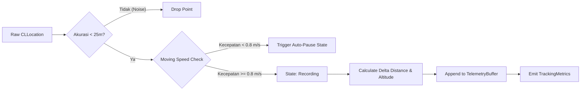
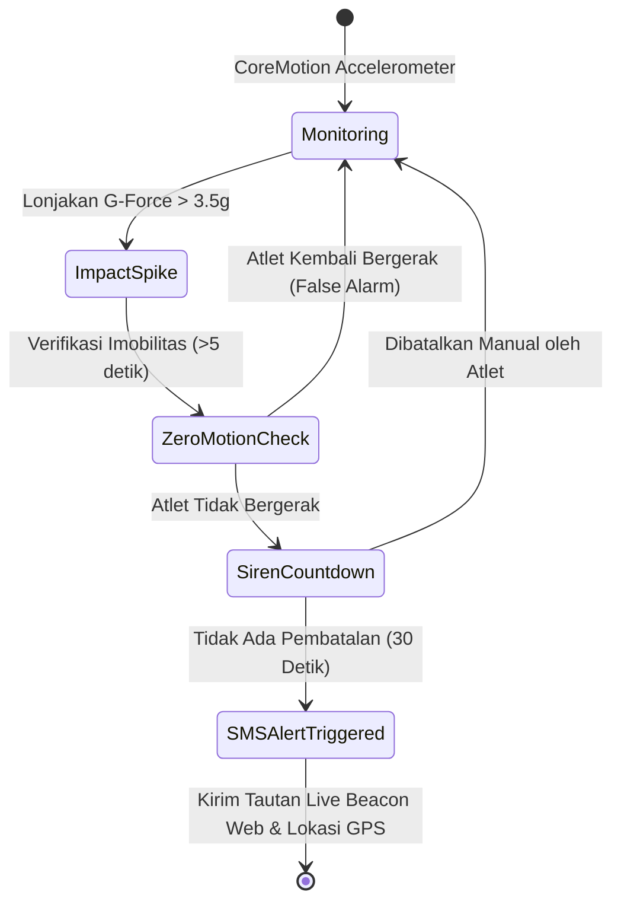

# 🏛️ StrideSync Architecture & Engineering Deep Dive

Dokumen ini menjelaskan secara rinci keputusan desain arsitektur, pola konkurensi **Swift 6**, manajemen memori, protokol komunikasi nirkabel, integrasi database cloud, dan algoritma matematis yang digunakan dalam pembangunan **StrideSync**.

---

## 1. Concurrency Model & Swift 6 Sendable Boundaries

Salah satu tantangan utama dalam aplikasi pelacak GPS modern adalah memastikan pengolahan koordinat berkecepatan tinggi tidak memblokir antarmuka pengguna (Main Thread) serta bebas dari *data race*.

```
┌─────────────────────────────────────────────────────────────┐
│                    @MainActor (UI Layer)                    │
│   RecordViewModel, FeedViewModel, SwiftUI Views & Charts    │
└──────────────────────────────┬──────────────────────────────┘
                               │ (Sends Commands / Receives Snapshots)
                               ▼
┌─────────────────────────────────────────────────────────────┐
│             actor LocationEngine (Worker Thread)            │
│  - Raw GPS Ingestion                                        │
│  - Distance Accumulation (WGS 84 Geodesic)                  │
│  - Auto-Pause State Machine                                 │
│  - Elevation Gain Accumulator                               │
└──────────────────────────────┬──────────────────────────────┘
                               │ (Pure Sendable Value Types)
                               ▼
┌─────────────────────────────────────────────────────────────┐
│          TelemetrySnapshot / ActivitySummarySnapshot        │
│          (Non-mutating Sendable Structs across Actors)      │
└─────────────────────────────────────────────────────────────┘
```

### Mengapa SwiftData `@Model` Tidak Dikirim Lintas Actor?
Dalam SwiftData, kelas yang dianotasi `@Model` bersifat non-Sendable dan terikat pada `ModelContext` tertentu. Oleh karena itu:
1. `LocationEngine` (sebuah `actor`) mengumpulkan data mentah dalam bentuk `struct TelemetrySnapshot: Sendable`.
2. Saat workout selesai (`finish()`), `LocationEngine` mengembalikan `(ActivitySummarySnapshot, [TelemetrySnapshot])`.
3. `@MainActor` atau ViewModel yang memiliki `ModelContext` aktif kemudian menginstansiasi entitas `@Model ActivityRecord` untuk disimpan ke database lokal.

---

## 2. GPS Telemetry Processing Pipeline

Setiap titik koordinat yang diterima dari `CLLocationManager` melalui delegasi dievaluasi dalam 4 tahapan filter sebelum dimasukkan ke dalam metrik latihan:



### 1. Accuracy Threshold Filter
Sinyal satelit yang memantul di antara gedung tinggi (*urban canyon effect*) sering menghasilkan lonjakan koordinat palsu. Titik dengan `horizontalAccuracy > 25.0 meter` atau bernilai negatif otomatis dieliminasi.

### 2. Auto-Pause Detection
Kondisi berhenti (misal di persimpangan lampu lalu lintas) dideteksi jika kecepatan sesaat berada di bawah ambang batas `0.8 m/s` (sekitar `2.88 km/jam`). Pada kondisi ini, timer waktu bergerak (*moving time*) dihentikan sementara sehingga nilai *average pace* atlet tetap akurat.

---

## 3. Algoritma Pencocokan Segmen (Virtual Segment Matching)

Segmen adalah potongan rute jalanan tertentu yang memiliki titik awal (*start coordinate*), titik akhir (*end coordinate*), dan daftar *waypoints*.

```
   [Start Gate (R=40m)]                     [End Gate (R=40m)]
          ●                                         ●
         / \                                       / \
        /   \                                     /   \
───────(  A  )───────────────────────────────────(  B  )────────▶ (Activity Path)
        \   /                                     \   /
         \ /                                       \ /
       t_start                                   t_finish
```

### Tahapan Algoritma:
1. **Entry Gate Detection**: Mencari titik dalam riwayat aktivitas yang jarak geodesiknya ke titik start segmen $\le 40\text{ meter}$.
2. **Sequential Verification**: Memastikan titik koordinat bergerak searah dengan segmen (bukan arah berlawanan).
3. **Exit Gate Detection**: Menemukan titik rute yang mencapai gerbang finish segmen $\le 40\text{ meter}$.
4. **Effort Elapsed Time**: Menghitung selisih waktu:
   $$\Delta t = t_{\text{finish}} - t_{\text{start}}$$
5. **KOM / PR Evaluation**: Membandingkan $\Delta t$ dengan rekor waktu sebelumnya untuk menentukan pemegang mahkota baru (*King of the Mountain*).

---

## 4. Geofencing Privacy Zone Algorithm

Untuk melindungi privasi alamat atlet, fungsi sanitasi memotong titik-titik koordinat yang berada dalam radius lingkaran privasi:

$$\text{isInsideZone}(P) \iff \text{distance}(P, C_{\text{zone}}) \le R_{\text{zone}}$$

Titik-titik yang memenuhi kondisi di atas akan disamarkan atau dihilangkan dari representasi rute visual publik, sementara kalkulasi total jarak tempuh tetap dipertahankan secara utuh.

---

## 5. Standar Ekspor/Impor GPX 1.1 XML & Garmin FIT 2.0
* **GPX 1.1:** Serialisasi rute ke XML standar ISO 8601 dengan tag `<trk>`, `<trkseg>`, `<trkpt lat="..." lon="...">`, `<ele>`, `<time>`.
* **FIT 2.0:** Serialisasi biner efisien tinggi untuk jam tangan Garmin dengan header 14-byte dan CRC checksum.

---

## 6. Cloud Database, Supabase & Row Level Security (RLS)

```
┌─────────────────────────────────────────────────────────────┐
│             StrideSync iOS (SwiftData Local-First)          │
│            Runs offline without cellular connection         │
└──────────────────────────────┬──────────────────────────────┘
                               │ (Two-Way Sync when Online)
                               ▼
┌─────────────────────────────────────────────────────────────┐
│                 CloudSyncEngine & CloudAPIService           │
│                 REST PostgREST API + Keychain JWT           │
└──────────────────────────────┬──────────────────────────────┘
                               │ (Secure TLS over HTTPS)
                               ▼
┌─────────────────────────────────────────────────────────────┐
│                Supabase Cloud (PostgreSQL 15+)              │
│  - Row Level Security (RLS) policies                        │
│  - Realtime Kudos & Comment Triggers                        │
│  - Zero Cost / Free Tier (Rp 0)                             │
└─────────────────────────────────────────────────────────────┘
```

### Row Level Security (RLS) Proteksi:
Setiap tabel di database PostgreSQL dilindungi oleh aturan RLS:
```sql
ALTER TABLE activities ENABLE ROW LEVEL SECURITY;
CREATE POLICY "Activities are publicly readable" ON activities FOR SELECT USING (true);
CREATE POLICY "Users can insert activities" ON activities FOR INSERT WITH CHECK (true);
```
Dengan RLS, pengguna hanya bisa memodifikasi atau menghapus data mereka sendiri, menjamin keamanan data atlet secara global.

---

## 7. Background Execution Modes & Audio Ducking

* **`UIBackgroundModes: location, audio`:** `LiveLocationManager` mengaktifkan `allowsBackgroundLocationUpdates = true` dan `showsBackgroundLocationIndicator = true` sehingga GPS tetap merekam tanpa terputus saat iPhone dimasukkan ke kantong.
* **Audio Ducking:** `AudioCueService` mengonfigurasi `AVAudioSession.sharedInstance().setCategory(.playback, mode: .voicePrompt, options: [.duckOthers])`. Saat pengumuman split 1-km diucapkan oleh pelatih suara, volume lagu di Spotify atau Apple Music otomatis dikecilkan sesaat dan kembali normal setelah selesai bicara.

---

## 8. Onboarding Interaktif (`OnboardingView.swift`)

Alur pembuka 3-langkah menggunakan komponen modern SwiftUI:
* **Slide 1:** Presisi GPS & 3D Flyover (Permohonan izin `CLLocationManager`).
* **Slide 2:** Pelatih Suara & Apple Health (Permohonan izin `HKHealthStore`).
* **Slide 3:** Komunitas Global & Live Buddy Radar.
* **Persistensi:** Disimpan di `@AppStorage("hasCompletedOnboarding")`.

---

## 9. Athletic Intelligence & Physiological Banister TRIMP Model

Kalkulasi beban fisiologis latihan pada [`TrainingLoadCalculator.swift`](file:///Users/mac/Downloads/swift-library/Sources/StrideSync/Services/TrainingLoadCalculator.swift) menerapkan formula **Banister TRIMP (Training Impulse)**:

$$w(t) = D \cdot \Delta\text{HR}_{\text{ratio}} \cdot 0.64 e^{1.92 \cdot \Delta\text{HR}_{\text{ratio}}} \quad (\text{Pria})$$
$$w(t) = D \cdot \Delta\text{HR}_{\text{ratio}} \cdot 0.86 e^{1.67 \cdot \Delta\text{HR}_{\text{ratio}}} \quad (\text{Wanita})$$

Di mana:
$$\Delta\text{HR}_{\text{ratio}} = \frac{\text{HR}_{\text{avg}} - \text{HR}_{\text{rest}}}{\text{HR}_{\text{max}} - \text{HR}_{\text{rest}}}$$
dan $D$ adalah durasi latihan dalam satuan menit.

```mermaid
graph LR
    A[Sesi Workout Selesai] --> B[Hitung TRIMP Skor]
    B --> C[ATL 7-Hari: Exponential Decay kelelahan]
    B --> D[CTL 28-Hari: Kebugaran Dasar]
    C & D --> E[TSB = CTL - ATL (Training Stress Balance)]
    E --> F[Kesiapan Tubuh: Fresh / Optimal / Overload / Exhausted]
    F --> G[Rekomendasi Jam Pemulihan Recovery Gauge]
```

* **Acute Training Load (ATL / Fatigue, $\tau = 7\text{ hari}$):**
  $$\text{ATL}_t = \text{ATL}_{t-1} + \frac{\text{TRIMP}_t - \text{ATL}_{t-1}}{7}$$
* **Chronic Training Load (CTL / Fitness, $\tau = 28\text{ hari}$):**
  $$\text{CTL}_t = \text{CTL}_{t-1} + \frac{\text{TRIMP}_t - \text{CTL}_{t-1}}{28}$$
* **Training Stress Balance (TSB / Form):**
  $$\text{TSB} = \text{CTL} - \text{ATL}$$

---

## 10. Algoritma GPX Turn-by-Turn & Cross-Track Error Navigation

Modul [`RouteNavigationEngine.swift`](file:///Users/mac/Downloads/swift-library/Sources/StrideSync/Services/RouteNavigationEngine.swift) memandu atlet mengikuti jalur GPX yang diimpor menggunakan perhitungan geometris geodesik:

```
                  P (Posisi Aktual Atlet)
                 /|
                / |  Cross-Track Distance (d_xt)
               /  |  [Threshold Peringatan: > 30m]
              /   ▼
        A ───●────X─────────────────────────────▶ B (Segmen Rute GPX)
      Waypoint_k                              Waypoint_{k+1}
```

1. **Pencarian Segmen Terdekat:** Mengidentifikasi segmen rute $[A, B]$ paling dekat dengan posisi atlet $P$.
2. **Kalkulasi Cross-Track Distance ($d_{\text{xt}}$):**
   $$d_{\text{xt}} = \arcsin\left(\sin(d_{AP}/R) \cdot \sin(\theta_{AP} - \theta_{AB})\right) \cdot R$$
   Jika $d_{\text{xt}} > 30\text{ meter}$, engine memicu getaran haptic peringatan rute menyimpang (*Off-Course Alert*).
3. **Peringatan Belokan Maju (*Look-ahead Waypoint*):** Mendeteksi sudut belokan pada $\Delta\text{heading} > 45^\circ$ dalam jarak 50m sebelum persimpangan.

---

## 11. Interpolasi Kamera 3D Aerial Satellite Flyover (Pitch 60°)

Modul [`FlyoverReplayEngine.swift`](file:///Users/mac/Downloads/swift-library/Sources/StrideSync/Services/FlyoverReplayEngine.swift) menghasilkan video visualisasi 3D dari koordinat GPS:

* **Kamera Satelit:** `MapCamera` dengan sudut kemiringan konstan $60^\circ$ (*pitch*) dan ketinggian relatif $400\text{ meter}$ di atas permukaan tanah.
* **Heading Interpolation:** Menghitung sudut arah kamera (*bearing*) secara kontinu mengikuti arah gerak rute:
  $$\theta = \text{atan2}(\sin\Delta\lambda \cdot \cos\phi_2, \; \cos\phi_1 \cdot \sin\phi_2 - \sin\phi_1 \cdot \cos\phi_2 \cdot \cos\Delta\lambda)$$
* **Milestone Detection:** Menandai kilometer split, tanjakan tertinggi (*peak altitude*), dan segmen sprint dengan pin visual 3D interaktif.

---

## 12. Protokol Biner Bluetooth SIG GATT Sensor BLE

Modul [`BLEHeartRateAndSensorManager.swift`](file:///Users/mac/Downloads/swift-library/Sources/StrideSync/Services/BLEHeartRateAndSensorManager.swift) memproses paket data biner `CoreBluetooth` standar Bluetooth SIG:

### 1. Heart Rate Measurement Service (`0x180D`, Karakteristik `0x2A37`)
* **Byte 0 (Flags):**
  * `Bit 0 = 0`: Format detak jantung 8-bit (`UInt8` pada Byte 1).
  * `Bit 0 = 1`: Format detak jantung 16-bit (`UInt16` pada Byte 1-2).
  * `Bit 4 = 1`: Terdapat data interval RR (detak per detak untuk HRV).

### 2. Cycling Power Service (`0x1818`, Karakteristik `0x2A63`)
* **Byte 0-1 (Flags):** Indikator keberadaan data Pedal Power Balance, Torque, dan Cadence.
* **Byte 2-3 (Instantaneous Power):** Nilai daya kayuhan atlet dalam satuan Watt (`Int16`, little-endian).
* **Crank Revolution & Event Time:** Kalkulasi cadence kayuhan (RPM) dari selisih revolusi pedal terhadap selisih waktu event ($1/1024\text{ detik}$).

---

## 13. Fall Detection & Live Emergency Safety Beacon

Sistem keamanan darurat pada [`FallDetectionEngine.swift`](file:///Users/mac/Downloads/swift-library/Sources/StrideSync/Services/FallDetectionEngine.swift) dan [`LiveSafetyBeaconService.swift`](file:///Users/mac/Downloads/swift-library/Sources/StrideSync/Services/LiveSafetyBeaconService.swift):



* **Impact Threshold:** Deteksi anomali akselerasi total $|G| = \sqrt{a_x^2 + a_y^2 + a_z^2} > 3.5\text{g}$.
* **Post-Impact Immobilitas:** Pengecekan gerak tubuh selama 5 detik setelah benturan.
* **Sirene & Countdown:** Tampilan layar penuh `EmergencyAlertOverlayView` dengan hitung mundur audio-haptic 30 detik sebelum pengiriman SMS darurat dan koordinat satelit otomatis.

