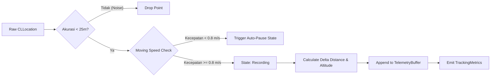

# 🏛️ StrideSync Architecture & Engineering Deep Dive

Dokumen ini menjelaskan secara rinci keputusan desain arsitektur, pola konkurensi **Swift 6**, manajemen memori, dan algoritma matematis yang digunakan dalam pembangunan **StrideSync**.

---

## 1. Concurrency Model & Swift 6 Sendable Boundaries

Salah satu tantangan utama dalam aplikasi pelacak GPS modern adalah memastikan pengolahan koordinat berkecepatan tinggi tidak memblokir antarmuka pengguna (Main Thread) serta bebas dari *data race*.

```
┌─────────────────────────────────────────────────────────────┐
│                    @MainActor (UI Layer)                    │
│   RecordViewModel, FeedViewModel, SwiftUI Views & Charts    │
└──────────────────────────────┬──────────────────────────────┘
                               │ (Sends Commands / Receives Snapshots)
                               ▼
┌─────────────────────────────────────────────────────────────┐
│             actor LocationEngine (Worker Thread)            │
│  - Raw GPS Ingestion                                        │
│  - Distance Accumulation (WGS 84 Geodesic)                  │
│  - Auto-Pause State Machine                                 │
│  - Elevation Gain Accumulator                               │
└──────────────────────────────┬──────────────────────────────┘
                               │ (Pure Sendable Value Types)
                               ▼
┌─────────────────────────────────────────────────────────────┐
│          TelemetrySnapshot / ActivitySummarySnapshot        │
│          (Non-mutating Sendable Structs across Actors)      │
└─────────────────────────────────────────────────────────────┘
```

### Mengapa SwiftData `@Model` Tidak Dikirim Lintas Actor?
Dalam SwiftData, kelas yang dianotasi `@Model` bersifat non-Sendable dan terikat pada `ModelContext` tertentu. Oleh karena itu:
1. `LocationEngine` (sebuah `actor`) mengumpulkan data mentah dalam bentuk `struct TelemetrySnapshot: Sendable`.
2. Saat workout selesai (`finish()`), `LocationEngine` mengembalikan `(ActivitySummarySnapshot, [TelemetrySnapshot])`.
3. `@MainActor` atau ViewModel yang memiliki `ModelContext` aktif kemudian menginstansiasi entitas `@Model ActivityRecord` untuk disimpan ke database lokal.

---

## 2. GPS Telemetry Processing Pipeline

Setiap titik koordinat yang diterima dari `CLLocationManager` melalui delegasi dievaluasi dalam 4 tahapan filter sebelum dimasukkan ke dalam metrik latihan:



### 1. Accuracy Threshold Filter
Sinyal satelit yang memantul di antara gedung tinggi (*urban canyon effect*) sering menghasilkan lonjakan koordinat palsu. Titik dengan `horizontalAccuracy > 25.0 meter` atau bernilai negatif otomatis dieliminasi.

### 2. Auto-Pause Detection
Kondisi berhenti (misal di persimpangan lampu lalu lintas) dideteksi jika kecepatan sesaat berada di bawah ambang batas `0.8 m/s` (sekitar `2.88 km/jam`). Pada kondisi ini, timer waktu bergerak (*moving time*) dihentikan sementara sehingga nilai *average pace* atlet tetap akurat.

---

## 3. Algoritma Pencocokan Segmen (Virtual Segment Matching)

Segmen adalah potongan rute jalanan tertentu yang memiliki titik awal (*start coordinate*), titik akhir (*end coordinate*), dan daftar *waypoints*.

```
   [Start Gate (R=40m)]                     [End Gate (R=40m)]
          ●                                         ●
         / \                                       / \
        /   \                                     /   \
───────(  A  )───────────────────────────────────(  B  )────────▶ (Activity Path)
        \   /                                     \   /
         \ /                                       \ /
       t_start                                   t_finish
```

### Tahapan Algoritma:
1. **Entry Gate Detection**: Mencari titik dalam riwayat aktivitas yang jarak geodesiknya ke titik start segmen $\le 40\text{ meter}$.
2. **Sequential Verification**: Memastikan titik koordinat bergerak searah dengan segmen (bukan arah berlawanan).
3. **Exit Gate Detection**: Menemukan titik rute yang mencapai gerbang finish segmen $\le 40\text{ meter}$.
4. **Effort Elapsed Time**: Menghitung selisih waktu:
   $$\Delta t = t_{\text{finish}} - t_{\text{start}}$$
5. **KOM / PR Evaluation**: Membandingkan $\Delta t$ dengan rekor waktu sebelumnya untuk menentukan pemegang mahkota baru (*King of the Mountain*).

---

## 4. Geofencing Privacy Zone Algorithm

Untuk melindungi privasi alamat atlet, fungsi sanitasi memotong titik-titik koordinat yang berada dalam radius lingkaran privasi:

$$\text{isInsideZone}(P) \iff \text{distance}(P, C_{\text{zone}}) \le R_{\text{zone}}$$

Titik-titik yang memenuhi kondisi di atas akan disamarkan atau dihilangkan dari representasi rute visual publik, sementara kalkulasi total jarak tempuh tetap dipertahankan secara utuh.

---

## 5. Standar Ekspor/Impor GPX 1.1 XML

Layanan [`GPXService.swift`](file:///Users/mac/Downloads/swift-library/Sources/StrideSync/Services/GPXService.swift) memproduksi berkas XML yang mematuhi skema resmi [Topografix GPX 1.1](http://www.topografix.com/GPX/1/1):

```xml
<?xml version="1.0" encoding="UTF-8"?>
<gpx version="1.1" creator="StrideSync iOS" xmlns="http://www.topografix.com/GPX/1/1" xmlns:gpxtpx="http://www.garmin.com/xmlschemas/TrackPointExtension/v1">
  <metadata>
    <name>Morning 10K Tempo Run 🏃‍♂️🔥</name>
    <time>2026-08-26T07:00:00Z</time>
  </metadata>
  <trk>
    <name>Morning 10K Tempo Run 🏃‍♂️🔥</name>
    <type>Run</type>
    <trkseg>
      <trkpt lat="-6.175392" lon="106.827153">
        <ele>15.0</ele>
        <time>2026-08-26T07:00:00Z</time>
        <extensions>
          <gpxtpx:TrackPointExtension>
            <gpxtpx:hr>148</gpxtpx:hr>
          </gpxtpx:TrackPointExtension>
        </extensions>
      </trkpt>
    </trkseg>
  </trk>
</gpx>
```

---

## 6. Integrasi Ekosistem Apple (ActivityKit, WidgetKit & HealthKit)

State perekaman disinkronisasikan ke Dynamic Island, Lock Screen, dan HealthKit:
- **Dynamic Island (`ActivityKit`)**:
  - **Compact Leading**: Ikon jenis olahraga (misal `figure.run`) dan indikator status *recording*.
  - **Compact Trailing**: Jarak tempuh saat ini (misal `5.24 km`).
  - **Expanded Layout**: Menampilkan metrik lengkap (Jarak, Moving Time, Current Pace, dan Detak Jantung) serta tombol aksi interaktif.
- **Home & Lock Screen Widgets (`WidgetKit`)**: [`StrideSyncWidgets.swift`](file:///Users/mac/Downloads/swift-library/Sources/StrideSync/LiveActivity/StrideSyncWidgets.swift) menyediakan `WeeklyMileageWidgetView` untuk grafik progres mingguan dan `QuickStartWorkoutWidgetView` untuk pintasan perekaman.
- **HealthKit Sync (`HKWorkoutBuilder`)**: [`HealthKitManager.swift`](file:///Users/mac/Downloads/swift-library/Sources/StrideSync/Services/HealthKitManager.swift) menyimpan sesi latihan menggunakan API modern `HKWorkoutBuilder` tanpa menggunakan initializer terdepresiasi.

---

## 7. Format Biner Garmin FIT 2.0 (`FITService.swift`)

Layanan [`FITService.swift`](file:///Users/mac/Downloads/swift-library/Sources/StrideSync/Services/FITService.swift) memproses file biner FIT 2.0 resmi Garmin:
1. **14-Byte Header**: Header biner berisi `header_size`, `protocol_version` (`0x20`), `profile_version` (`2100`), `data_size`, dan magic string `.FIT`.
2. **File ID & Session Record**: Menyuplai metadata jenis latihan, durasi bergerak, dan total jarak tempuh.
3. **Telemetry Data Records**: Mengonversi latitude/longitude ke *semicircles* Int32:
   $$\text{semicircles} = \text{degrees} \times \left( \frac{2^{31}}{180} \right)$$
4. **Alignment Safety Unpackers**: Menghindari *misaligned memory pointer crash* dengan ekstrak data byte-by-byte secara aman.

---

## 8. Layer Keamanan & Enkripsi Keychain (`KeychainManager.swift`)

Untuk mematuhi standar NFR 4 (Privacy & Security), kredensial sensitif atlet dan token JWT disisolasi menggunakan `Security.framework` pada [`KeychainManager.swift`](file:///Users/mac/Downloads/swift-library/Sources/StrideSync/Services/KeychainManager.swift):
- Menggunakan `kSecClassGenericPassword` dengan query spesifik `com.stridesync.app`.
- Menyuplai otomatis header HTTP Authorization `Bearer <token>` pada setiap panggilan network client.

---

## 9. Network API Client & Background Sync (`NetworkClient.swift` & `BackgroundSyncManager.swift`)

- **Asynchronous REST Client**: [`NetworkClient.swift`](file:///Users/mac/Downloads/swift-library/Sources/StrideSync/Services/NetworkClient.swift) menangani panggilan ke endpoint backend (`APIEndpoint`) secara non-blocking dengan fallback *mock mode*.
- **Offline Upload Queue**: [`BackgroundSyncManager.swift`](file:///Users/mac/Downloads/swift-library/Sources/StrideSync/Services/BackgroundSyncManager.swift) mengamankan aktivitas yang tersimpan saat perangkat offline dan menjadwalkan unggahan otomatis via `BGTaskScheduler` saat perangkat online kembali.

---

## 10. SwiftData Versioned Schema & Strategy Migrasi (`StrideSyncSchema.swift`)

- **VersionedSchema V1**: [`StrideSyncSchemaV1`](file:///Users/mac/Downloads/swift-library/Sources/StrideSync/Models/StrideSyncSchema.swift#L5) mengkapsulasi entitas `@Model` `ActivityRecord`, `TelemetryPoint`, `DistanceSplit`, dan `Segment`.
- **Migration Plan**: [`StrideSyncMigrationPlan`](file:///Users/mac/Downloads/swift-library/Sources/StrideSync/Models/StrideSyncSchema.swift#L19) mengatur alur migrasi database lokal secara aman untuk mendukung rilis versi skema berikutnya tanpa risiko kehilangan data atlet.


