```mermaid
graph TD
    A[StrideSync App] --> B[1. Tracking & Engine]
    A --> C[2. Analytics & History]
    A --> D[3. Social & Community]
    A --> E[4. Segments & Gamification]
    A --> F[5. Apple Ecosystem Integration]

    B --> B1[Real-time GPS Tracking]
    B --> B2[Auto-Pause & Resume]
    B --> B3[Audio Cues / Voice Feedback]
    B --> B4[Heart Rate & Sensor Sync]

    C --> C1[Interactive Map & Elevation Profile]
    C --> C2[Kilometer Splits & Pacing Chart]
    C --> C3[Gear / Shoe Mileage Tracker]
    C --> C4[GPX / FIT Export]

    D --> D1[Social Feed & Following]
    D --> D2[Kudos & Comments]
    D --> D3[Story Card Generator]
    D --> D4[Clubs & Group Events]

    E --> E1[GPS Segment Matching]
    E --> E2[Leaderboard KOM/QOM]
    E --> E3[Monthly Challenges & Badges]

    F --> F1[Live Activities & Dynamic Island]
    F --> F2[Apple Watch Standalone App]
    F --> F3[HealthKit & CoreMotion Sync]
    F --> F4[Lock Screen / Home Widgets]
```

# Product Requirement Document (PRD)
## Project: StrideSync (Swift-based Fitness & Activity Tracking Application)
**Version:** 0.5.0-beta  
**Status:** In Active Beta Testing & Community Preview  
**Target Platform:** iOS 17+ / 18+ (Swift 6, SwiftUI), companion watchOS app  

---

## 1. Executive Summary & Vision

### 1.1 Product Overview
**StrideSync** is an outdoor physical activity tracking application (running, cycling, hiking, walking) and athletic social platform for iOS. It integrates high-precision GPS tracking, deep fitness telemetry analytics, native Apple ecosystem integration (HealthKit, Apple Watch, Live Activities / Dynamic Island), and community social features (Social Feed, Kudos, Segments, Leaderboards, and Challenges).

### 1.2 Product Objectives
1. Provide an accurate, power-efficient, and responsive workout recording experience.
2. Build a social ecosystem where athletes can encourage each other and share achievements.
3. Leverage modern native iOS capabilities (Swift 6, SwiftUI, SwiftData, ActivityKit, CoreLocation modern async streams).
4. Provide gamification features through street route segments and monthly challenges.

---

## 2. Target Users & User Personas

| Persona | Profile & Needs | Primary Features Used |
| :--- | :--- | :--- |
| **Casual Runner / Walker** | Wants to record casual runs, view distance and calories, and share results to social media / friend feeds. | Simple recording, Social Feed, Visual Share Card, Apple Health sync. |
| **Enthusiast Cyclist** | Rides 50–100 km on weekends. Requires speed metrics, elevation depth, heart rate, cadence, and auto-pause. | Pro GPS telemetry, Live Activities, BLE/HealthKit sensor integration, Elevation & split analytics. |
| **Competitive Athlete** | Marathon runner chasing personal bests (PB/PR) and competing on specific street segments against other runners. | Segments & KOM/QOM leaderboards, pacing splits per km, weekly mileage tracking. |

---

## 3. Key Features & Functional Requirements

### 3.1 Module 1: Activity Recording Engine (Core Engine)
* **FR-1.1 Activity Type Selection:** Supports *Outdoor Run, Cycling, Walk, Trail Run, Hiking, Treadmill/Indoor Run*.
* **FR-1.2 Real-time GPS Tracking:** 
  * Uses `CoreLocation` async stream (`CLLocationUpdate.liveUpdates()`).
  * Stores location coordinate points (latitude, longitude, altitude, timestamp, speed, horizontalAccuracy).
  * Applies GPS noise filtering (Kalman Filter / Distance threshold filter) to prevent false distance spikes during weak signal conditions.
* **FR-1.3 Recording Controls:** Start, Pause, Resume, Stop, Discard, Save.
* **FR-1.4 Auto-Pause Detection:** Automatically detects when the user stops (e.g. at traffic lights) based on threshold speed (< 1.5 km/h) and `CoreMotion` activity data.
* **FR-1.5 Live Telemetry Display:** Displays live distance, moving time, average / current pace (min/km), elevation gain, and real-time heart rate.
* **FR-1.6 Audio Cues / Voice Feedback:** Voice announcements via `AVSpeechSynthesizer` at configurable distance intervals (e.g., "Kilometer 1, time 5 minutes 12 seconds, average pace 5:12").
* **FR-1.7 Privacy Zones:** Ability to hide route polylines within a configurable radius (e.g. 500m around home/office) from public view.

---

### 3.2 Module 2: Post-Activity Summary & Deep Analytics
* **FR-2.1 Interactive Route Map (MapKit):** Route map rendered with color gradients based on speed, pace, or elevation.
* **FR-2.2 Split Analytics:** Detailed per-kilometer pace breakdown (time, pace, elevation change per split).
* **FR-2.3 Elevation & Heart Rate Profile:** Interactive charts correlating elevation changes with heart rate and pacing variations.
* **FR-2.4 Activity Metadata:** Title, description, photo uploads, Rate of Perceived Exertion (RPE 1–10), and gear/shoe tracking.
* **FR-2.5 File Export/Import:** Supports importing and exporting route files in `.gpx` and `.fit` formats.

---

### 3.3 Module 3: Social & Community Feed
* **FR-3.1 Chronological / Algorithmic Feed:** Displays recent workouts from followed athletes and friends.
* **FR-3.2 Social Interactions (Kudos & Comments):** Give Kudos appreciation and discuss activities in comment sections.
* **FR-3.3 Athlete Profile:** Bio, weekly/monthly/yearly performance stats (total distance, duration, elevation), trophy case, and public activities.
* **FR-3.4 Shareable Visual Card:** Generates aesthetic stat card graphics overlaid on route maps for sharing to social platforms.
* **FR-3.5 Clubs / Communities:** Community group pages with group leaderboards and group events.

---

### 3.4 Module 4: Segments & Gamification
* **FR-4.1 GPS Route Segments:** Specific route sections created by the community (e.g., steep climbs or park loops).
* **FR-4.2 KOM / QOM Leaderboard:** Ranks athletes based on fastest elapsed segment attempt time.
* **FR-4.3 Personal Records (PR/PB):** Detects personal records for 1K, 5K, 10K, Half Marathon, and Full Marathon.
* **FR-4.4 Monthly Challenges & Badges:** Virtual trophies for completing monthly distance or elevation targets.

---

### 3.5 Module 5: Apple Ecosystem Integration
* **FR-5.1 ActivityKit Live Activities:** Live workout status on Lock Screen and Dynamic Island.
* **FR-5.2 HealthKit Sync:** Bi-directional synchronization with Apple Health (`HKWorkout`).
* **FR-5.3 Standalone watchOS App:** Independent workout recording on Apple Watch.

---

## 4. Non-Functional Requirements (NFR)

* **NFR-1 Performance:** 60 FPS UI rendering, sub-10ms coordinate processing on background actor (`LocationEngine`).
* **NFR-2 Battery Efficiency:** Less than 6% battery consumption per hour during active GPS recording.
* **NFR-3 Security & Privacy:** Session tokens encrypted in Keychain (`KeychainManager`), Row Level Security (RLS) on cloud database, and geofence masking for sensitive coordinates.
* **NFR-4 Concurrency & Stability:** 100% compliant with Swift 6 Strict Concurrency without warnings or data races.

---

## 5. Technical Specifications & Stack

- **iOS Version:** iOS 17.0+ / 18.0+
- **Language:** Swift 6.0
- **UI & Map:** SwiftUI, MapKit, Charts
- **Persistence:** SwiftData (`@Model`)
- **Backend:** Supabase PostgreSQL Free Tier
- **Testing:** Swift Testing Framework (81/81 Passing)
