# Product Requirement Document (PRD)
## Project: StrideSync (Aplikasi Fitness & Activity Tracking berbasis Swift)
**Versi:** 0.5.0-beta  
**Status:** In Active Beta Testing & Community Preview  
**Target Platform:** iOS 17+ / 18+ (Swift 6, SwiftUI), watchOS companion  

---

## 1. Executive Summary & Vision

### 1.1 Product Overview
**StrideSync** adalah aplikasi pelacak aktivitas fisik (running, cycling, hiking, walking) dan platform sosial olahraga berbasis iOS/Swift yang mengadaptasi konsep **Strava**. Aplikasi ini mengintegrasikan pelacakan GPS berpresisi tinggi, analisis telemetri kebugaran mendalam, integrasi ekosistem Apple (HealthKit, Apple Watch, Live Activities/Dynamic Island), serta fitur sosial komunitas (Feed, Kudos, Segmen, Leaderboard, dan Challenges).

### 1.2 Tujuan Produk
1. Memberikan pengalaman perekaman rute dan metrik olahraga yang akurat, hemat baterai, dan responsif.
2. Membangun ekosistem sosial di mana atlet dan pegiat olahraga dapat saling menyemangati dan berbagi pencapaian.
3. Memanfaatkan kapabilitas native iOS terkini (Swift 6, SwiftUI, SwiftData, ActivityKit, CoreLocation modern async streams).
4. Menyediakan fitur *gamification* melalui segmen rute jalanan dan tantangan bulanan.

---

## 2. Target Pengguna & User Persona

| Persona | Profil & Kebutuhan | Fitur Utama yang Digunakan |
| :--- | :--- | :--- |
| **Casual Runner / Walker** | Ingin merekam lari santai, melihat jarak dan kalori, serta membagikan hasilnya ke Instagram Stories / feed teman. | Perekaman simpel, Feed sosial, Share card grafis, Apple Health sync. |
| **Enthusiast Cyclist** | Bersepeda 50-100km di akhir pekan. Memerlukan metrik kecepatan, elevasi mendalam, detak jantung, cadence, dan auto-pause. | GPS telemetri tinggi, Live Activity, Integrasi sensor BLE/HealthKit, Analisis elevasi & splits. |
| **Competitive Athlete** | Pelari maraton yang mengejar rekor personal (PB/PR) dan ingin bersaing di segmen jalan tertentu melawan pelari lain. | Segmen & KOM/QOM leaderboard, pacing splits per km, weekly mileage tracking. |

---

## 3. Fitur Utama & Functional Requirements

```mermaid
graph TD
    A[StrideSync App] --> B[1. Tracking & Engine]
    A --> C[2. Analytics & History]
    A --> D[3. Social & Community]
    A --> E[4. Segments & Gamification]
    A --> F[5. Apple Ecosystem Integration]

    B --> B1[Real-time GPS Tracking]
    B --> B2[Auto-Pause & Resume]
    B --> B3[Audio Cues / Voice Feedback]
    B --> B4[Heart Rate & Sensor Sync]

    C --> C1[Interactive Map & Elevation Profile]
    C --> C2[Kilometer Splits & Pacing Chart]
    C --> C3[Gear / Shoe Mileage Tracker]
    C --> C4[GPX / FIT Export]

    D --> D1[Social Feed & Following]
    D --> D2[Kudos & Comments]
    D --> D3[Story Card Generator]
    D --> D4[Clubs & Group Events]

    E --> E1[GPS Segment Matching]
    E --> E2[Leaderboard KOM/QOM]
    E --> E3[Monthly Challenges & Badges]

    F --> F1[Live Activities & Dynamic Island]
    F --> F2[Apple Watch Standalone App]
    F --> F3[HealthKit & CoreMotion Sync]
    F --> F4[Lock Screen / Home Widgets]
```



### 3.1 Modul 1: Activity Recording Engine (Core Engine)
* **FR-1.1 Pilihan Jenis Aktivitas:** Mendukung *Outdoor Run, Cycling, Walk, Trail Run, Hiking, Treadmill/Indoor Run*.
* **FR-1.2 Real-time GPS Tracking:** 
  * Menggunakan `CoreLocation` dengan stream async (`CLLocationUpdate.liveUpdates()`).
  * Menyimpan titik koordinat (latitude, longitude, altitude, timestamp, speed, horizontalAccuracy).
  * Filter noise GPS (Kalman Filter / Distance threshold filter) untuk mencegah lonjakan jarak palsu saat sinyal lemah.
* **FR-1.3 Kontrol Perekaman:** Start, Pause, Resume, Stop, Discard, Save.
* **FR-1.4 Auto-Pause Detection:** Secara otomatis mendeteksi saat pengguna berhenti (misal di lampu merah) berdasarkan kecepatan ambang batas (< 1.5 km/jam) dan data gerak `CoreMotion`.
* **FR-1.5 Live Telemetry Display:** Menampilkan jarak tempuh, durasi bergerak (moving time), pace rata-rata / saat ini (min/km), elevasi naik (elevation gain), dan denyut jantung secara live.
* **FR-1.6 Audio Cues / Audio Feedback:** Panggilan suara via `AVSpeechSynthesizer` setiap kelipatan jarak tertentu (misal: "Kilometer 1, waktu 5 menit 12 detik, pace rata-rata 5:12").
* **FR-1.7 Privacy Zones:** Kemampuan menyembunyikan rute dalam radius tertentu (misal 500m di sekitar rumah/kantor) agar tidak terlihat publik.

---

### 3.2 Modul 2: Post-Activity Summary & Deep Analytics
* **FR-2.1 Peta Rute Interaktif (MapKit):** Peta rute dengan gradien warna berdasarkan kecepatan/pace atau elevasi.
* **FR-2.2 Analisis Splits:** Rincian kecepatan per kilometer (waktu, pace, elevation change per split).
* **FR-2.3 Elevation & Heart Rate Profile:** Grafik visual interaktif hubungan antara elevasi jalur dengan detak jantung dan pace.
* **FR-2.4 Activity Metadata:** Penambahan judul aktivitas, deskripsi, foto dokumentasi, rating tingkat kelelahan (RPE 1-10), dan gear/sepatu/sepeda yang digunakan.
* **FR-2.5 Ekspor/Impor File:** Mendukung ekspor dan impor file rute format `.gpx` dan `.fit`.

---

### 3.3 Modul 3: Social & Community Feed
* **FR-3.1 Feed Kronologis / Algoritmik:** Menampilkan aktivitas terbaru dari teman/atlet yang diikuti.
* **FR-3.2 Interaksi Sosial (Kudos & Komentar):** Memberikan "Kudos" (apresiasi jempol/claps) dan berdiskusi di kolom komentar.
* **FR-3.3 Athlete Profile:** Menampilkan bio, statistik performa mingguan/bulanan/tahunan (total jarak, durasi, elevasi), lemari piala (trophy case), dan daftar aktivitas publik.
* **FR-3.4 Shareable Visual Card:** Menghasilkan gambar stat card yang estetik dengan overlay peta dan metrik untuk langsung dibagikan ke Instagram Stories, WhatsApp, atau disimpan ke galeri foto.
* **FR-3.5 Clubs / Komunitas:** Halaman grup/komunitas dengan papan peringkat (club leaderboard) dan obrolan/event grup.

---

### 3.4 Modul 4: Segments & Gamification
* **FR-4.1 Segmen Rute (GPS Segments):** Bagian rute jalan tertentu yang dibuat oleh komunitas (misal: tanjakan curam atau lintasan lari di taman kota).
* **FR-4.2 Segment Matching Engine:** Algoritma mencocokkan lintasan GPS aktivitas dengan polylines segmen yang terdaftar di database.
* **FR-4.3 Leaderboards & Gelar:**
  * **KOM / QOM (King/Queen of the Mountain):** Pemegang waktu tercepat di suatu segmen.
  * **PR (Personal Record):** Rekor waktu terbaik diri sendiri di segmen tersebut.
  * Filter leaderboard: *All-Time, This Year, Today, Following, Age Group*.
* **FR-4.4 Monthly Challenges & Badges:** Tantangan rutin (contoh: "Run 100K in March", "Climb 2000m") dengan reward lencana virtual (trophy badge) di profil.

---

### 3.5 Modul 5: Apple Ecosystem & Platform Features
* **FR-5.1 Live Activities & Dynamic Island (`ActivityKit`):** Menampilkan durasi, jarak, dan pace saat layar terkunci (Lock Screen) atau di Dynamic Island secara real-time.
* **FR-5.2 Apple Watch Companion (`watchOS`):**
  * Perekaman standalone mandiri di jam tangan tanpa perlu membawa iPhone.
  * Pembacaan sensor detak jantung langsung dari optical HR sensor Apple Watch.
  * Sinkronisasi data workout secara instan ke iPhone saat terhubung (`WatchConnectivity`).
* **FR-5.3 Apple HealthKit Sync:** Membaca data metrik tubuh dan otomatis menuliskan sesi latihan ke Apple Health (Activity Rings).
* **FR-5.4 iOS Widgets (`WidgetKit`):** Widget Home Screen & Lock Screen untuk progress jarak mingguan dan shortcut mulai merekam.

---

### 3.6 Modul 6: Athletic Intelligence & Analisis Fisiologis (v2.0)
* **FR-6.1 Training Load & Recovery Advisor:** Perhitungan skor kelelahan berbasis Banister TRIMP & rekomendasi jam waktu istirahat tubuh.
* **FR-6.2 AI Voice Pacing Coach:** Pemandu audio real-time berdasarkan target pace split yang ditetapkan atlet sebelum latihan.
* **FR-6.3 Structured Interval Workout Builder:** Pembuat menu latihan interval bertingkat (Warm-up, Interval repetitions, Cool-down) dengan HUD transisi getar.
* **FR-6.4 Cadence Metronome & Running Dynamics:** Metronom audio-haptic (160–190 SPM) serta metrik panjang langkah dan waktu kontak tanah via `CoreMotion`.

---

### 3.7 Modul 7: Live Safety Beacon & GPX Course Navigation (v2.0)
* **FR-7.1 Live Safety Beacon:** Berbagi link peta live web terenkripsi ke kontak darurat via WhatsApp/SMS dengan status baterai dan ETA.
* **FR-7.2 Turn-by-Turn GPX Navigation:** Navigasi arah jalur rute dan peringatan haptic saat atlet keluar dari jalur (> 30 meter).
* **FR-7.3 Ghost Pacer:** Visual avatar lawan virtual di HUD melawan rekor pribadi (PR) atau waktu mahkota KOM secara live.
* **FR-7.4 Fall & Incident Detection:** Deteksi tabrakan/jatuh mendadak via `CoreMotion` dengan sirene hitung mundur 30 detik sebelum SMS darurat otomatis.

---

### 3.8 Modul 8: Hardware Ekosistem BLE & Apple Modern APIs (v2.0)
* **FR-8.1 Sensor Bluetooth Eksternal (`CoreBluetooth`):** Integrasi chest-strap Heart Rate monitor (`0x180D`), sensor cadence sepeda (`0x1816`), dan Power Meter / Wattage FTP (`0x1818`).
* **FR-8.2 iOS 18 Control Center & Action Button:** Pintasan cepat mulai latihan via `ControlWidget` dan tombol Action Button (`AppIntents`).
* **FR-8.3 Interactive Live Activity:** Tombol Pause/Resume dan Lap marker langsung di layar Dynamic Island / Lock Screen.

---

### 3.9 Modul 9: Visual Media & Personal Spatial Heatmap (v2.0)
* **FR-9.1 3D Animated Route Video Flyover:** Generator video 3D rute vertikal 9:16 untuk Instagram Reels & TikTok.
* **FR-9.2 Personal Global Heatmap ("Tile Hunter"):** Peta satelit eksplorasi yang menampilkan akumulasi seluruh rute seumur hidup atlet.
* **FR-9.3 Live Group Run Buddy Radar:** Menampilkan titik lokasi teman satu komunitas secara live di peta HUD saat latihan bersama.

---

## 4. Arsitektur Teknis & Tech Stack (Swift iOS)

### 4.1 Technology Stack

```
+-------------------------------------------------------------+
|                      User Interface                         |
|      SwiftUI (iOS 18+), ActivityKit (Dynamic Island),       |
|               WidgetKit, MapKit (SwiftUI Maps)             |
+-------------------------------------------------------------+
|                     Presentation Logic                      |
|          MVVM / Clean Architecture + Swift Concurrency      |
|                 (@Observable, async/await, Actors)          |
+-------------------------------------------------------------+
|                        Domain Logic                         |
|   LocationEngine (Actor), SegmentMatcher, PaceCalculator,   |
|         AudioCueService, HealthKitManager (Actor)           |
+-------------------------------------------------------------+
|                      Data & Networking                      |
|       SwiftData / CoreData (Local DB, Offline-first)        |
|        URLSession / gRPC (REST/GraphQL Cloud API)           |
|            KeychainAccess (Security & Auth Tokens)          |
+-------------------------------------------------------------+
```

| Layer | Komponen / Framework | Deskripsi |
| :--- | :--- | :--- |
| **Language** | Swift 6 | Strict concurrency checking, Data-race safety, modern macros. |
| **UI Framework** | SwiftUI | Deklaratif, modern, kompatibel lintas iOS, watchOS, dan iPadOS. |
| **Map & Routing** | MapKit / MapLibre | Rendering peta rute interaktif, polylines, annotasi split kilometer. |
| **GPS & Motion** | CoreLocation, CoreMotion | Async location updates (`CLLocationUpdate`), altimeter, pedometer. |
| **Health & Sensors** | HealthKit | Heart rate streaming, Active energy burned, VO2 Max. |
| **Background & OS** | ActivityKit, BackgroundTasks | Background location recording, Live Activity, Background sync. |
| **Storage & Caching**| SwiftData | Model penyimpanan lokal (Aktivitas, Koordinat, Atlet, Cache Feed). |
| **Watch Integration**| WatchConnectivity | Transfer data workout antara Apple Watch dan iPhone. |

---

## 5. Skema Data Model Utama (SwiftData / Core Entities)

```swift
import Foundation
import SwiftData
import CoreLocation

@Model
final class ActivityRecord {
    @Attribute(.unique) var id: UUID
    var title: String
    var activityType: ActivityType // .run, .ride, .walk, .hike
    var startTime: Date
    var endTime: Date
    var distanceMeters: Double
    var durationSeconds: TimeInterval
    var movingTimeSeconds: TimeInterval
    var totalElevationGainMeters: Double
    var averageSpeedMps: Double
    var maxSpeedMps: Double
    var averageHeartRate: Int?
    var maxHeartRate: Int?
    var caloriesBurned: Double?
    var notes: String?
    var visibility: VisibilityType // .publicVisibility, .followersOnly, .privateVisibility
    
    // Relasi data
    @Relationship(deleteRule: .cascade) var telemetryPoints: [TelemetryPoint]
    @Relationship(deleteRule: .cascade) var splits: [DistanceSplit]
    var photoUrls: [String]
    
    init(
        id: UUID = UUID(),
        title: String,
        activityType: ActivityType,
        startTime: Date,
        endTime: Date,
        distanceMeters: Double,
        durationSeconds: TimeInterval,
        movingTimeSeconds: TimeInterval,
        totalElevationGainMeters: Double,
        averageSpeedMps: Double,
        maxSpeedMps: Double,
        averageHeartRate: Int? = nil,
        maxHeartRate: Int? = nil,
        caloriesBurned: Double? = nil,
        notes: String? = nil,
        visibility: VisibilityType = .publicVisibility
    ) {
        self.id = id
        self.title = title
        self.activityType = activityType
        self.startTime = startTime
        self.endTime = endTime
        self.distanceMeters = distanceMeters
        self.durationSeconds = durationSeconds
        self.movingTimeSeconds = movingTimeSeconds
        self.totalElevationGainMeters = totalElevationGainMeters
        self.averageSpeedMps = averageSpeedMps
        self.maxSpeedMps = maxSpeedMps
        self.averageHeartRate = averageHeartRate
        self.maxHeartRate = maxHeartRate
        self.caloriesBurned = caloriesBurned
        self.notes = notes
        self.visibility = visibility
        self.telemetryPoints = []
        self.splits = []
        self.photoUrls = []
    }
}

enum ActivityType: String, Codable, CaseIterable {
    case run = "Run"
    case ride = "Ride"
    case walk = "Walk"
    case hike = "Hike"
}

enum VisibilityType: String, Codable {
    case publicVisibility = "Public"
    case followersOnly = "Followers Only"
    case privateVisibility = "Private"
}

@Model
final class TelemetryPoint {
    var timestamp: Date
    var latitude: Double
    var longitude: Double
    var altitude: Double
    var speedMps: Double
    var heartRate: Int?
    var cadence: Int?
    
    init(timestamp: Date, latitude: Double, longitude: Double, altitude: Double, speedMps: Double, heartRate: Int? = nil, cadence: Int? = nil) {
        self.timestamp = timestamp
        self.latitude = latitude
        self.longitude = longitude
        self.altitude = altitude
        self.speedMps = speedMps
        self.heartRate = heartRate
        self.cadence = cadence
    }
}

@Model
final class DistanceSplit {
    var splitIndex: Int // Kilometer ke-1, 2, dst
    var distanceMeters: Double
    var durationSeconds: TimeInterval
    var averagePaceSecondsPerKm: Double
    var elevationChangeMeters: Double
    
    init(splitIndex: Int, distanceMeters: Double, durationSeconds: TimeInterval, averagePaceSecondsPerKm: Double, elevationChangeMeters: Double) {
        self.splitIndex = splitIndex
        self.distanceMeters = distanceMeters
        self.durationSeconds = durationSeconds
        self.averagePaceSecondsPerKm = averagePaceSecondsPerKm
        self.elevationChangeMeters = elevationChangeMeters
    }
}
```

---

## 6. Non-Functional Requirements (NFR)

1. **Efisiensi Baterai:**
   * Penggunaan baterai selama perekaman GPS aktif maksimal 5-8% per jam pada iPhone standar.
   * Throttling update frekuensi lokasi secara adaptif saat pengguna berhenti.
2. **Kinerja & Latensi:**
   * Rendering peta rute stabil di 60/120 fps tanpa frame drops.
   * Cold start aplikasi < 1.2 detik.
   * 100% fungsional saat offline (offline-first architecture).
3. **Presisi & Integritas Data:**
   * GPS drift rejection: mengabaikan titik koordinat dengan `horizontalAccuracy > 25 meter`.
   * Deteksi anomali kecepatan (mencegah manipulasi jarak lari saat menggunakan kendaraan bermotor).
4. **Keamanan & Privasi:**
   * *Hide Home/Work Location*: Radius privasi otomatis menyembunyikan titik start/finish pada rute publik.
   * Manajemen izin lokasi yang transparan (`NSLocationAlwaysAndWhenInUseUsageDescription`).
   * Enkripsi data sensitif pengguna dengan Keychain & Secure Enclave.

---

## 7. Desain Navigasi & Struktur UI (SwiftUI)

Aplikasi menggunakan struktur **Bottom Tab Bar 5-Menu**:

1. **Feed (Home):**
   * Timeline aktivitas komunitas & teman.
   * Tombol Kudos, komentar, dan tombol share card.
2. **Explore / Maps:**
   * Peta eksplorasi segmen lokal dan rute populer di sekitar lokasi pengguna.
   * Daftar klub dan event olahraga.
3. **Record (Action Button Tengah - Highlighted):**
   * Tampilan layar penuh HUD perekaman GPS.
   * Peta live tracking, angka metrik besar (Distance, Time, Pace, HR).
   * Tombol Pause/Resume dan Slider Geser untuk Finish.
4. **Challenges & Groups:**
   * Papan peringkat kompetisi bulanan.
   * Progress tantangan (misal: "Progress: 42/100 km").
5. **Profile / You:**
   * Riwayat kalender aktivitas (Heatmap kalender tahunan ala GitHub/Strava).
   * Statistik performa (Weekly / Monthly Mileage, Elevation).
   * Rak Sepatu / Sepeda (Gear tracker & umur pakai).

---

## 8. Rencana Tahapan Rilis (Development Roadmap)

### Phase 1: MVP & Core Tracking (v0.1 - v0.3)
- [x] Setup arsitektur Swift 6, SwiftUI, SwiftData.
- [x] Core Location Tracking Engine (Start, Pause, Resume, Stop, Auto-Pause).
- [x] Live Metrics Display & Real-time MapKit route rendering.
- [x] Audio Cues setiap kilometer via `AVSpeechSynthesizer`.
- [x] Halaman ringkasan aktivitas (Splits, Elevation, Pace).
- [x] Penyimpanan lokal SwiftData & Snapshot actors.

### Phase 2: Live Activity & Cloud Backend (v0.4 - v0.5.0-beta)
- [x] Live Activities & Dynamic Island (`ActivityKit`).
- [x] Integrasi HealthKit (Heart Rate, Calories, sync to Apple Fitness).
- [x] WidgetKit (Home & Lock Screen Widgets).
- [x] Pembuatan Shareable Social Card (Image generation untuk IG Story 9:16).
- [x] Pengaturan Privacy Zones (Geofencing 100m-1000m).
- [x] Garmin FIT 2.0 Binary Encoder & GPX 1.1 Exporter.
- [x] Cloud Backend Supabase (PostgreSQL + Row Level Security).
- [x] 81 Unit Tests (100% Passing).

### Phase 3: Field Testing & Battery Optimization (v0.6.0-beta - Next)
- [ ] Pengujian lapangan jangka panjang di iPhone fisik (lari 10K / 21K).
- [ ] Validasi konsumsi daya baterai di background (< 6% per jam).
- [ ] Uji coba filtering GPS di area gedung padat (*urban canyon*).

### Phase 4: Hardware BLE & Real-World Group Radar Trial (v0.7.0-beta)
- [ ] Field trial sensor eksternal Bluetooth SIG (Chest Strap HR & Cycling Power Meter).
- [ ] Pengujian Live Safety Beacon & Group Run Radar bersama komunitas pelari lokal.

### Phase 5: App Store Submission & TestFlight Publik (v1.0.0 Stable)
- [ ] Finalisasi aset promosi App Store dan String Catalog i18n.
- [ ] Pengajuan App Store Review & rilis Apple TestFlight publik.

*(Rincian lengkap dan matriks pengujian unit dapat dilihat pada dokumen [ROADMAP.md](file:///Users/mac/Downloads/swift-library/ROADMAP.md)).*

---

## 9. Key Performance Indicators (KPIs)
* **Crash-free session rate:** > 99.8%
* **GPS tracking reliability:** 0% data hilang saat aplikasi berjalan di background atau ada panggilan telepon masuk.
* **Daily Active Users (DAU) / Monthly Active Users (MAU) Ratio:** Target > 35%.
* **Activity Completion Rate:** > 85% aktivitas yang dimulai diselesaikan dan disimpan.


