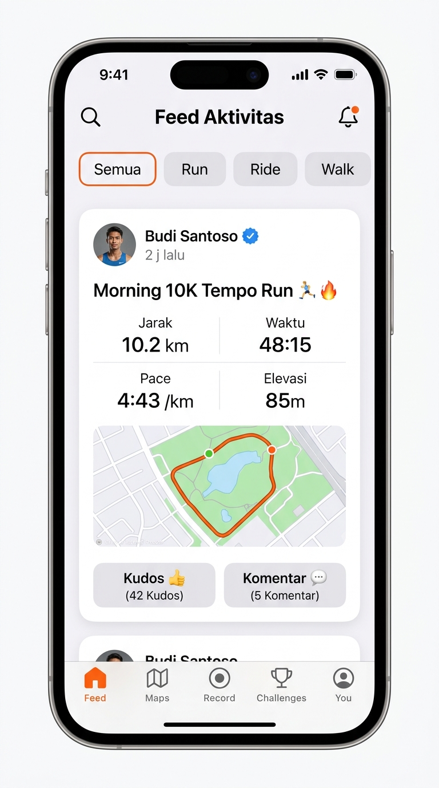
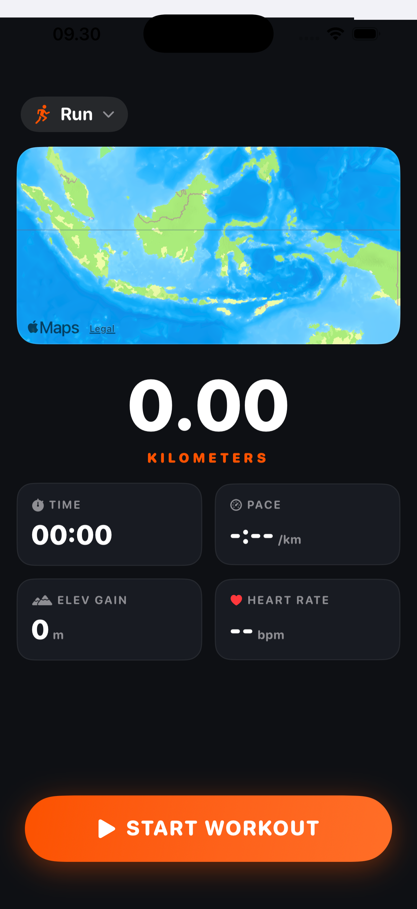
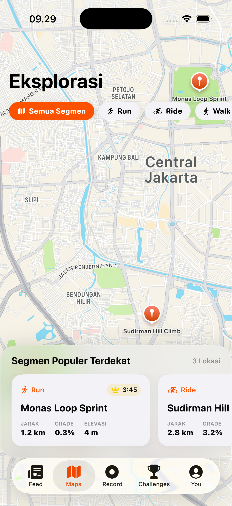
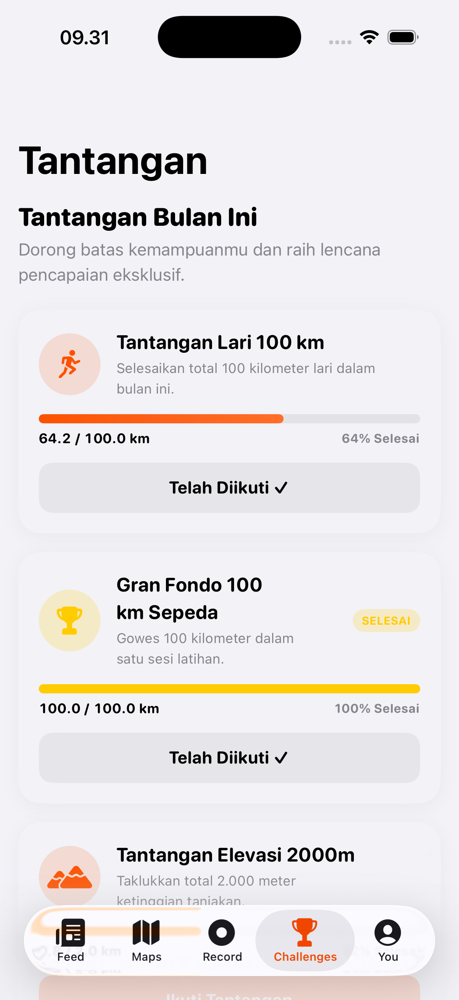
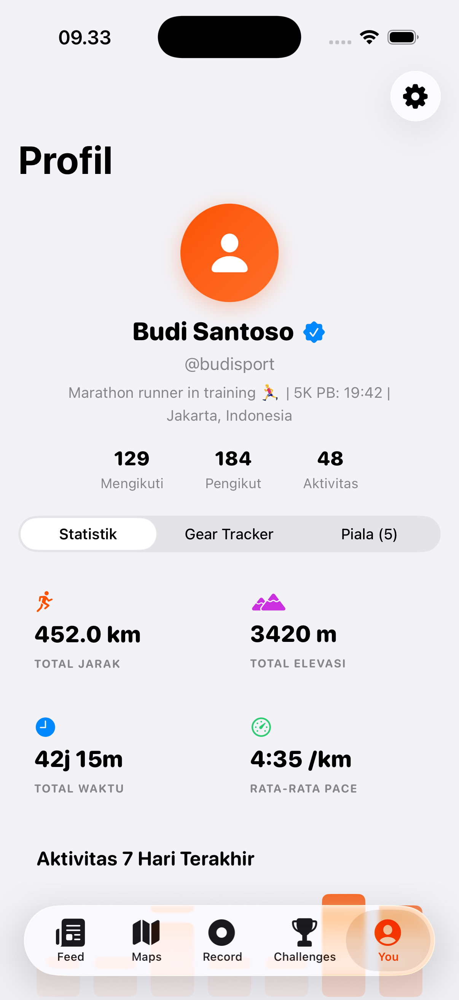
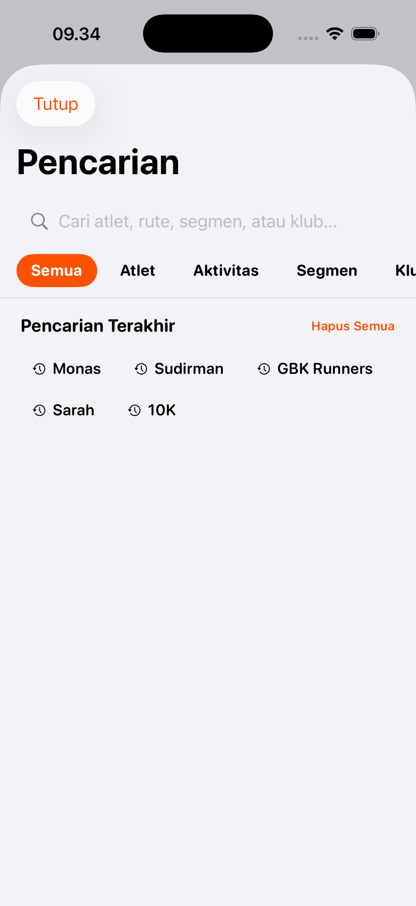

# 🏃‍♂️⚡️ StrideSync iOS

<div align="center">

[](https://swift.org)
[](https://apple.com)
[](https://developer.apple.com/xcode/swiftui/)
[](https://developer.apple.com/documentation/swiftdata)
[](https://stridesync-web.vercel.app)
[-2ECC71.svg?style=for-the-badge)]()
[-success.svg?style=for-the-badge)]()
[](LICENSE)

**A high-performance, modern athletic intelligence and GPS running platform built with Swift 6, SwiftUI, SwiftData, CoreLocation Actors, MapKit, ActivityKit (Dynamic Island), HealthKit, Supabase PostgreSQL, and Garmin FIT 2.0.**

🌐 **Live Web Preview:** [https://stridesync-web.vercel.app](https://stridesync-web.vercel.app)  
💻 **Repositori Web:** [https://github.com/Irs622/stridesync-web](https://github.com/Irs622/stridesync-web)  
📥 **Download .IPA Langsung:** [StrideSync.ipa (v3.5 Pro)](https://stridesync-web.vercel.app/downloads/StrideSync.ipa)

[Tampilan Aplikasi](#-tampilan-antarmuka-aplikasi-visual-showcase) • [Fitur Utama](#-fitur-utama-core-features) • [Arsitektur Cloud & Keamanan](#-arsitektur-cloud--database-gratis-rp-0) • [Panduan Menjalankan Rp 0](#-cara-menjalankan-aplikasi-100-gratis-rp-0) • [Struktur Proyek](#-struktur-direktori-proyek) • [Dokumentasi Lengkap](#-dokumentasi-lengkap)

</div>

---

## 📱 Tampilan Antarmuka Aplikasi (Visual Showcase)

<div align="center">
<table>
  <tr>
    <td align="center" width="33%">
      
      <br />
      <b>📰 1. Community Feed</b>
      <br />
      <sub>Linimasa sosial, filter olahraga & Kudos</sub>
    </td>
    <td align="center" width="33%">
      
      <br />
      <b>⏱️ 2. Pro HUD Recording</b>
      <br />
      <sub>OLED dark theme, live GPS & metrik besar</sub>
    </td>
    <td align="center" width="33%">
      
      <br />
      <b>🗺️ 3. Explore & Segmen</b>
      <br />
      <sub>Peta interaktif & rute tanjakan populer</sub>
    </td>
  </tr>
  <tr>
    <td align="center" width="33%">
      
      <br />
      <b>🏆 4. Tantangan Bulanan</b>
      <br />
      <sub>Progress bar 100K & piala virtual</sub>
    </td>
    <td align="center" width="33%">
      
      <br />
      <b>👤 5. Profil & Gear Tracker</b>
      <br />
      <sub>Statistik atlet & umur pakai sepatu/sepeda</sub>
    </td>
    <td align="center" width="33%">
      
      <br />
      <b>🔍 6. Pencarian Global</b>
      <br />
      <sub>Pencarian cerdas atlet, aktivitas & klub</sub>
    </td>
  </tr>
</table>
</div>

---

## 🌟 Tentang Proyek (About StrideSync)

**StrideSync** adalah platform pelacak aktivitas atletik luar ruangan (lari, bersepeda, hiking, dan jalan santai) berbasis iOS yang memadukan keandalan **GPS Engine kelas telemetri** dengan **ekosistem sosial komunitas olahraga modern**.

Proyek ini dirancang dari awal dengan prinsip **Local-First, Zero-Cost Resilience, Security-First & Privacy-First Architecture**:
* 💸 **100% Gratis & Bebas Biaya Server (Rp 0):** Berjalan secara *Local-First* menggunakan **SwiftData** dan terhubung ke **Supabase Cloud (PostgreSQL Free Tier)** tanpa biaya bulanan sepeser pun.
* 🛡️ **Privasi & Enkripsi Atlet Terjamin:** Data lokasi di sekitar rumah disanitasi dengan geofence masking, Row Level Security (RLS) di database cloud, serta token sesi tersimpan aman di **Apple Keychain Security Framework**.
* ⚡️ **Swift 6 Strict Concurrency:** Mengeliminasi seluruh potensi *data race* pada pemrosesan koordinat GPS dengan mengisolasi perhitungan pada `actor LocationEngine`.
* 🎧 **Background Modes & Audio Ducking:** GPS tetap melacak rute di saku celana saat layar terkunci dan suara pelatih (*Audio Cues*) otomatis mengecilkan lagu Spotify / Apple Music.
* 🎨 **Native App Icon & Asset Catalog:** Dilengkapi paket aset icon resmi 1024x1024 px di `Resources/Assets.xcassets/AppIcon.appiconset`.
* 📦 **Dual Export Engine:** Ekspor dan impor data rute dalam format **GPX 1.1 XML** dan format biner Garmin **FIT 2.0**.

---

## 🛠️ Tumpukan Teknologi (Tech Stack)

| Kategori | Teknologi / Framework | Deskripsi Penggunaan |
| :--- | :--- | :--- |
| **Language** | **Swift 6.0** | Strict Concurrency Checking (`-swift-version 6`), Actor isolation, Sendable models |
| **UI Framework** | **SwiftUI & MapKit** | Declarative modern UI, `MapPolyline` gradient styling, custom markers, haptics |
| **Persistence** | **SwiftData** | `@Model` relational local-first storage dengan zero memory leakage |
| **Project Setup** | **StrideSync.xcodeproj** | Native iOS target dengan bundle ID `irsalteam.stridesync` & shared scheme |
| **Cloud Backend** | **Supabase (PostgreSQL 15+)** | Cloud Database, Row Level Security (RLS), Multi-user Social Feed & Segments |
| **Auth & Security** | **Sign in with Apple & Keychain** | Apple ID 1-tap auth, Email auth & `SecItem` API Keychain encryption |
| **Background Modes**| **CoreLocation & AVFoundation** | `UIBackgroundModes: location, audio` dengan audio ducking Spotify/Apple Music |
| **Live Tracking** | **ActivityKit & WidgetKit** | Dynamic Island, Lock Screen Live Activities & Home Screen widgets |
| **Health Sync** | **HealthKit** | Otorisasi dan sinkronisasi workout native via `HKWorkoutBuilder` |
| **Export Engines**| **GPX 1.1 & Garmin FIT 2.0** | Generator XML GPX 1.1 dan Encoder/Decoder biner Garmin FIT 2.0 |
| **P2P Radar** | **CoreBluetooth (BLE)** | Pemindaian detak jantung, cycling power GATT & direct mesh Buddy Radar |
| **Testing** | **Swift Testing Framework** | **81 Unit Tests** lulus 100% pada 37 Test Suites |

---

## 🚀 Fitur Utama (Core Features)

### 1. 🛰️ Pro-Grade GPS & Telemetry Engine
- **Actor-Isolated Location Tracking (`LocationEngine`)**: Mengisolasi proses penerimaan koordinat GPS pada background actor terpisah untuk mencegah *race condition* dan *main-thread blocking*.
- **GPS Noise & Drift Rejection**: Menolak koordinat dengan akurasi horizontal rendah (`> 25 meter`) dan menyaring anomali lonjakan kecepatan.
- **Smart Auto-Pause & Resume**: Otomatis menjeda perekaman saat atlet berhenti di lampu merah (`speed < 0.8 m/s`) dan melanjutkan kembali saat bergerak.
- **Kilometer Splits Calculator**: Menghitung *pacing split* dan akumulasi elevasi secara presisi per kilometer.

### 2. 👻 Virtual Ghost Runner
- Berlari melawan bayangan catatan waktu terbaik pribadi (PR) atau target pace tertentu dengan indikator delta jarak (+/- meter) real-time di layar.

### 3. ⛰️ Climb Classifier & UCI Grade Analysis
- Deteksi otomatis tanjakan kategori standar UCI / Strava (*Cat 4, 3, 2, 1, dan Hors Catégorie / HC*) dengan perhitungan Climb Score dan Grade Adjusted Pace (GAP).

### 4. 📊 Training Load (Banister TRIMP) & Recovery Gauge
- Kalkulasi beban fisiologis latihan berbasis formula matematis **Banister TRIMP**, pemodelan kelelahan sesaat (*Acute Load ATL* 7 hari), kebugaran dasar (*Chronic Load CTL* 28 hari), dan estimasi jam pemulihan otot.

### 5. 👑 Virtual Segments & KOM/QOM Leaderboard
- **Spatial Segment Matcher**: Algoritma pencocokan polylines rute terhadap segmen virtual jalanan dengan radius toleransi pintu masuk/keluar (*gate radius* 40m).
- **Crown & Personal Record (PR)**: Penentuan gelar **King/Queen of the Mountain (KOM/QOM)** tercepat dan pemecahan rekor pribadi.

### 6. 🎯 Live Audio Pacing Coach & Audio Ducking
- Mengatur target waktu tempuh balapan (*Sub-20m 5K, Sub-50m 10K, Sub-4h Marathon*) dengan evaluasi delta waktu real-time dan panduan suara taktis bilingual via `AVSpeechSynthesizer`.

### 7. 📶 External Bluetooth BLE Sensors (CoreBluetooth)
- Pemindaian dan pembacaan paket biner standar Bluetooth SIG GATT untuk sensor dada detak jantung (`0x180D`/`0x2A37`) dan sensor daya kayuh sepeda (*Cycling Power* `0x1818`/`0x2A63`).

---

## 💻 Cara Menjalankan & Memasang Aplikasi

### 1. Membuka di Xcode (macOS)
```bash
# 1. Clone repositori
git clone https://github.com/Irs622/stridesync-ios.git
cd stridesync-ios

# 2. Buka proyek Xcode native
open StrideSync.xcodeproj
```

### 2. Menjalankan via Terminal Langsung
```bash
# Build untuk iOS Simulator / Perangkat Fisik
xcodebuild build -project StrideSync.xcodeproj -scheme StrideSync -destination 'generic/platform=iOS'
```

### 3. Memasang ke iPhone Fisik Anda (100% Gratis / Rp 0)
1. Sambungkan iPhone ke Mac dengan kabel data USB.
2. Di Xcode: Buka target **StrideSync** → tab **Signing & Capabilities**.
3. Pilih **Personal Team (Apple ID gratis)** Anda (`PU23ZB2X47`).
4. Pilih iPhone Anda di bagian atas, lalu klik **▶️ Play (Run)**.
5. Pada iPhone: Buka **Settings** → **General** → **VPN & Device Management** → klik **Trust Developer**.

---

## 📁 Struktur Direktori Proyek

```
stridesync-ios/
├── StrideSync.xcodeproj/            # Konfigurasi Proyek Xcode Native (iOS App)
│   ├── project.pbxproj              # Target, Build Settings, & Permissions
│   └── xcshareddata/xcschemes/      # Shared Scheme StrideSync
├── Package.swift                    # Konfigurasi Swift Package Manager (Swift 6)
├── Resources/
│   └── Assets.xcassets/
│       └── AppIcon.appiconset/      # Aset Ikon Aplikasi Resmi iOS (1024x1024)
├── Sources/
│   └── StrideSync/
│       ├── AppMain.swift            # Entry Point @main SwiftUI App
│       ├── Models/                  # SwiftData Models & Codable DTOs
│       ├── Services/                # GPS Actor, Audio, BLE, Supabase, SyncEngine
│       ├── ViewModels/              # Observable MVVM State Managers
│       └── Views/                   # SwiftUI Screens (HUD, Onboarding, Social, Profile)
├── database/
│   └── schema.sql                   # Skema PostgreSQL Cloud + RLS Policies
├── docs/
│   ├── APP_STORE_GUIDE.md           # Panduan Lengkap App Store Review & TestFlight
│   └── FREE_DEPLOYMENT_GUIDE.md     # Panduan Instalasi Fisik Tanpa Bayar (Rp 0)
└── Tests/
    └── StrideSyncTests/             # 81 Unit Tests across 37 Test Suites (100% PASS)
```

---

## 📄 Lisensi & Kredit

- **Pembuat / Developer**: [Irsal Shydiq](https://github.com/Irs622)
- **Website Promosi**: [https://stridesync-web.vercel.app](https://stridesync-web.vercel.app)
- Dibangun dengan dedikasi untuk komunitas pelari dan pegiat olahraga Indonesia 🇮🇩
