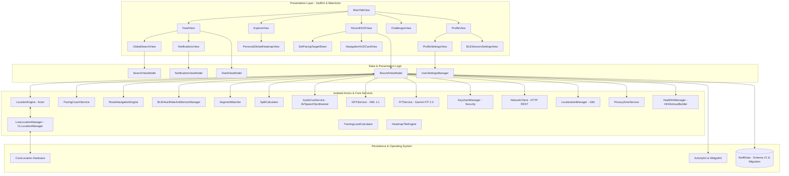

# 🏃‍♂️ StrideSync iOS

<div align="center">

[](https://swift.org)
[](https://apple.com)
[](https://developer.apple.com/xcode/swiftui/)
[](https://developer.apple.com/documentation/swiftdata)
[](https://github.com/Irs622/stridesync-ios/actions)
[-brightgreen.svg?style=flat-square)]()
[](.swiftlint.yml)
[](LICENSE)

**A high-performance, modern Strava-like fitness tracking and social networking iOS platform built with Swift 6, SwiftUI, SwiftData, CoreLocation Actors, MapKit, ActivityKit (Dynamic Island), WidgetKit, HealthKit, and Garmin FIT 2.0.**

[Tampilan Aplikasi](#-tampilan-antarmuka-aplikasi-visual-showcase) • [Fitur Utama](#-fitur-utama) • [Arsitektur Teknis](#-arsitektur-teknis) • [Algoritma & Engineering](#-algoritma--engineering) • [Struktur Proyek](#-struktur-direktori-proyek) • [Cara Menjalankan](#-cara-menjalankan-proyek) • [Dokumentasi](#-dokumentasi-lengkap)

</div>

---

## 📱 Tampilan Antarmuka Aplikasi (Visual Showcase)

<div align="center">
<table>
  <tr>
    <td align="center" width="33%">
      
      <br />
      <b>📰 1. Community Feed</b>
      <br />
      <sub>Linimasa sosial, filter olahraga & Kudos</sub>
    </td>
    <td align="center" width="33%">
      
      <br />
      <b>⏱️ 2. Pro HUD Recording</b>
      <br />
      <sub>OLED dark theme, live GPS & metrik besar</sub>
    </td>
    <td align="center" width="33%">
      
      <br />
      <b>🗺️ 3. Explore & Segmen</b>
      <br />
      <sub>Peta interaktif & rute tanjakan populer</sub>
    </td>
  </tr>
  <tr>
    <td align="center" width="33%">
      
      <br />
      <b>🏆 4. Tantangan Bulanan</b>
      <br />
      <sub>Progress bar 100K & piala virtual</sub>
    </td>
    <td align="center" width="33%">
      
      <br />
      <b>👤 5. Profil & Gear Tracker</b>
      <br />
      <sub>Statistik atlet & umur pakai sepatu/sepeda</sub>
    </td>
    <td align="center" width="33%">
      
      <br />
      <b>🔍 6. Pencarian Global</b>
      <br />
      <sub>Pencarian cerdas atlet, aktivitas & klub</sub>
    </td>
  </tr>
</table>
</div>

---

## 🌟 Tentang Proyek (About StrideSync)

**StrideSync** adalah platform pelacak aktivitas atletik luar ruangan (lari, bersepeda, hiking, dan jalan santai) berbasis iOS yang memadukan keandalan **GPS Engine kelas telemetri** dengan **ekosistem sosial komunitas olahraga modern**.

Proyek ini dirancang dari awal dengan prinsip **Local-First, Security-First & Privacy-First Architecture**:
* 🛡️ **Privasi & Enkripsi Atlet Terjamin:** Data lokasi di sekitar rumah disanitasi dengan geofence masking, serta kredensial/token pengguna tersimpan aman di **Apple Keychain Security Framework**.
* ⚡️ **Swift 6 Strict Concurrency:** Mengeliminasi seluruh potensi *data race* pada pemrosesan koordinat GPS dengan mengisolasi perhitungan pada `actor LocationEngine`.
* 💾 **Modern SwiftData Persistence & Versioning:** Menggunakan **SwiftData** `VersionedSchema` (`V1`) dan `SchemaMigrationPlan` untuk keamanan pembaruan struktur basis data.
* 🍏 **Native Apple Ecosystem:** Memanfaatkan **ActivityKit (Dynamic Island & Lock Screen Live Activities)**, **WidgetKit (Home & Lock Screen Widgets)**, **HealthKit `HKWorkoutBuilder`**, dan **ImageRenderer** untuk berbagai kartu grafis Story resolusi tinggi.
* 📦 **Dual Export Engine:** Ekspor dan impor data rute dalam format **GPX 1.1 XML** dan format biner Garmin **FIT 2.0**.

---

## 🛠️ Tumpukan Teknologi (Tech Stack)

| Kategori | Teknologi / Framework | Deskripsi Penggunaan |
| :--- | :--- | :--- |
| **Language** | **Swift 6.0** | Strict Concurrency Checking (`-swift-version 6`), Actor isolation, Sendable models |
| **UI Framework** | **SwiftUI & MapKit** | Declarative modern UI, `MapPolyline` gradient styling, custom markers, haptics |
| **Persistence** | **SwiftData & Schema Versioning** | `@Model` relational storage, `VersionedSchema` (`V1`) & `SchemaMigrationPlan` |
| **Security** | **Keychain Security Framework** | `SecItem` API untuk enkripsi kredensial & auth token pengguna |
| **Live Tracking** | **ActivityKit & WidgetKit** | Dynamic Island, Lock Screen Live Activities & Home Screen widgets (`WeeklyMileageWidget`) |
| **Health Sync** | **HealthKit** | Otorisasi dan sinkronisasi workout native via modern `HKWorkoutBuilder` |
| **Export Engines**| **GPX 1.1 & Garmin FIT 2.0** | Generator XML GPX 1.1 dan Encoder/Decoder biner Garmin FIT 2.0 dengan alignment safety |
| **Networking** | **NetworkClient & Offline Queue** | Async HTTP REST client dengan Bearer auth injection & `BackgroundSyncManager` upload queue |
| **Voice & i18n** | **AVFoundation & LocalizationManager** | Voice feedback `AVSpeechSynthesizer` & dynamic English/Indonesian i18n |
| **Analytics** | **AnalyticsService** | Telemetry event logging, screen view tracking & performance metrics |
| **CI / CD** | **GitHub Actions** | Automated macOS 14 / Xcode 16 pipeline untuk build, linting, dan test suites |

---

## 🚀 Fitur Utama (Core Features)

### 1. 🛰️ Pro-Grade GPS & Telemetry Engine
- **Actor-Isolated Location Tracking (`LocationEngine`)**: Mengisolasi proses penerimaan koordinat GPS pada background actor terpisah untuk mencegah *race condition* dan *main-thread blocking*.
- **GPS Noise & Drift Rejection**: Menolak koordinat dengan akurasi horizontal rendah (`> 25 meter`) dan menyaring anomali lonjakan kecepatan.
- **Smart Auto-Pause & Resume**: Otomatis menjeda perekaman saat atlet berhenti di lampu merah (`speed < 0.8 m/s`) dan melanjutkan kembali saat bergerak.
- **Kilometer Splits Calculator**: Menghitung *pacing split* dan akumulasi elevasi secara presisi per kilometer.

### 2. 📱 Dynamic Island, Lock Screen & WidgetKit
- **ActivityKit Integration**: Menampilkan jarak, durasi bergerak, dan *pace* langsung di Dynamic Island (tampilan *compact* & *expanded*) serta Lock Screen widget saat iPhone terkunci.
- **WidgetKit Widgets**: Widget Home Screen & Lock Screen untuk progres jarak mingguan (`WeeklyMileageWidgetView`) dan pintasan cepat latihan (`QuickStartWorkoutWidgetView`).

### 3. 👑 Virtual Segments & KOM/QOM Leaderboard
- **Spatial Segment Matcher**: Algoritma pencocokan polylines rute terhadap segmen virtual jalanan dengan radius toleransi pintu masuk/keluar (*gate radius* 40m).
- **Crown & Personal Record (PR)**: Penentuan gelar **King/Queen of the Mountain (KOM/QOM)** tercepat dan pemecahan rekor pribadi.

### 4. 🛡️ Geofence Privacy, Keychain & Dual Export (GPX + FIT 2.0)
- **Privacy Geofencing**: Menyembunyikan titik awal dan akhir rute dalam radius tertentu (misal 500m di sekitar rumah atau kantor) untuk melindungi privasi atlet pada peta publik.
- **Garmin FIT 2.0 & GPX 1.1 Support**: Ekspor dan impor data rute dalam format biner Garmin FIT 2.0 dan XML GPX 1.1 lengkap dengan timestamp ISO-8601 dan elevasi.
- **Keychain Security**: Penyimpanan aman token autentikasi dan preferensi privasi sensitif menggunakan `Security.framework`.

### 5. 🗣️ Umpan Balik Suara & Lokalisasi Dinamis (i18n)
- **Audio Voice Cues**: Sintesis suara native via `AVSpeechSynthesizer` yang mengumumkan *pace split*, total waktu latihan, dan detak jantung.
- **Dynamic Localization**: Mendukung perpindahan bahasa antarmuka dinamis antara Bahasa Indonesia (`.id`) dan Bahasa Inggris (`.en`).

### 6. 👥 Linimasa Sosial, Pencarian & Notifikasi
- **Community Feed**: Linimasa aktivitas olahraga dengan animasi haptic **Kudos**, kolom komentar, dan *filter chip* multi-kategori.
- **Pusat Notifikasi**: Notifikasi interaktif saat menerima Kudos, komentar, atau saat rekor KOM Anda tergeser oleh atlet lain.
- **Pencarian Global**: Pencarian cerdas lintas 4 dimensi (*Atlet, Aktivitas, Segmen, dan Klub Komunitas*).
- **9:16 Story Card Generator**: Penghasil kartu grafis estetik untuk dibagikan langsung ke Instagram Story.

### 7. 👟 Gear Tracker (Umur Sepatu & Sepeda)
### 8. 🎯 Live Audio Pacing Coach & Target Splits
- Mengatur target waktu tempuh balapan (*Sub-20m 5K, Sub-50m 10K, Sub-4h Marathon*) dengan evaluasi delta waktu real-time (*ahead/behind status*) dan panduan suara taktis bilingual via `AVSpeechSynthesizer`.

### 9. 🧭 GPX Turn-by-Turn Navigation & Vector Steering
- Panduan rute interaktif dari file GPX dengan deteksi sudut belokan (*bearing delta*), estimasi jarak manuver, dan peringatan getar haptik otomatis saat atlet keluar jalur (*cross-track error > 30m*).

### 10. 📊 Training Load (Banister TRIMP) & Recovery Gauge
- Kalkulasi beban fisiologis latihan berbasis formula matematis **Banister TRIMP**, pemodelan kelelahan sesaat (*Acute Load ATL* 7 hari), kebugaran dasar (*Chronic Load CTL* 28 hari), dan estimasi jam pemulihan otot.

### 11. 📶 External Bluetooth BLE Sensors (CoreBluetooth)
- Pemindaian dan pembacaan paket biner standar Bluetooth SIG GATT untuk sensor dada detak jantung (`0x180D`/`0x2A37`) dan sensor daya kayuh sepeda (*Cycling Power* `0x1818`/`0x2A63`).

### 12. 🗺️ Personal Global Heatmap & Spatial Tile Hunter
- Agregasi seluruh koordinat GPS seumur hidup ke dalam petak peta satelit Web Mercator (*Zoom 14*) dengan pendaran neon oranye dan sistem lencana eksplorasi kota.

### 13. ⌚️ Standalone watchOS Companion App
- Arsitektur perekaman otonom di pergelangan tangan dengan sensor internal Apple Watch dan antarmuka HUD OLED kontras tinggi.

---

## 🏗️ Arsitektur Teknis (System Architecture)

Aplikasi mengadopsi arsitektur **Clean MVVM-C (Model-View-ViewModel-Coordinator)** dengan pembagian batas konkurensi Swift 6:



---

## 📁 Struktur Direktori Proyek

```
Sources/
├── StrideSync/
│   ├── AppMain.swift                    # @main struct StrideSyncApp (iOS Application Entry)
│   ├── StrideSyncApp.swift              # Root View & SwiftData Container configuration
│   ├── Models/
│   │   ├── ActivityType.swift           # Tipe olahraga (Run, Ride, Walk, Hike), Visibility, States
│   │   ├── TelemetryPoint.swift         # Titik GPS SwiftData entity & TelemetrySnapshot (Sendable)
│   │   ├── DistanceSplit.swift          # Model split kilometer + SplitSnapshot
│   │   ├── ActivityRecord.swift         # Entitas SwiftData aktivitas utama + ActivitySummarySnapshot
│   │   ├── Segment.swift                # Model segmen virtual jalanan & leaderboard (KOM/QOM, PR)
│   │   ├── SocialModels.swift           # AthleteProfile, Kudos, Comment, Challenge, GearItem
│   │   ├── UserSettings.swift           # UserSettingsManager dengan Keychain & UserDefaults sync
│   │   ├── StrideSyncSchema.swift       # SwiftData VersionedSchema V1 & SchemaMigrationPlan
│   │   ├── NotificationItem.swift       # Model pesan & notifikasi sosial
│   │   ├── PacingTarget.swift           # Model target split, presets & delta feedback
│   │   ├── NavigationModels.swift       # Model manuver navigasi GPX turn-by-turn
│   │   ├── TrainingLoadModels.swift     # Model Banister TRIMP, ATL/CTL & recovery readiness
│   │   ├── BLESensorModels.swift        # Model sensor eksternal CoreBluetooth & telemetri
│   │   └── HeatmapModels.swift          # Model petak Web Mercator Slippy Tile & badge
│   ├── Services/
│   │   ├── LocationEngine.swift         # Actor pengolah GPS real-time & filter noise
│   │   ├── LiveLocationManager.swift    # Bridge CLLocationManager hardware iPhone
│   │   ├── SplitCalculator.swift        # Kalkulator split 1km/mil
│   │   ├── SegmentMatcher.swift         # Algoritma pencocokan segmen jalanan
│   │   ├── PacingCoachService.swift     # Evaluator pacing real-time & audio feedback
│   │   ├── RouteNavigationEngine.swift  # Engine navigasi GPX & kalkulasi cross-track error
│   │   ├── TrainingLoadCalculator.swift # Kalkulator Banister TRIMP & recovery gauge
│   │   ├── BLEHeartRateAndSensorManager.swift # Manager sensor eksternal Bluetooth SIG
│   │   ├── HeatmapTileEngine.swift      # Engine konversi WGS84 ke Slippy Tiles Zoom 14
│   │   ├── WatchWorkoutEngine.swift     # Engine mandiri workout Apple Watch
│   │   ├── AudioCueService.swift        # Voice feedback AVSpeechSynthesizer
│   │   ├── GPXService.swift             # Ekspor/Impor format GPX 1.1 XML
│   │   ├── FITService.swift             # Encoder/Decoder format biner Garmin FIT 2.0
│   │   ├── KeychainManager.swift        # Encrypted storage via Security.framework
│   │   ├── NetworkClient.swift          # REST API client & Bearer token injection
│   │   ├── LocalizationManager.swift    # Dynamic i18n localization (English & Indonesian)
│   │   ├── AnalyticsService.swift       # Event logging & screen view telemetry
│   │   ├── BackgroundSyncManager.swift  # Queue upload offline & BGTaskScheduler
│   │   ├── PrivacyZoneService.swift     # Geofence masking lokasi rumah/kantor
│   │   ├── HealthKitManager.swift       # Integrasi Apple HealthKit (HKWorkoutBuilder)
│   │   └── WatchSessionManager.swift    # Bidirectional WatchConnectivity sync
│   ├── ViewModels/
│   │   ├── RecordViewModel.swift        # State machine perekaman HUD, Live Activities & GPS stream
│   │   ├── FeedViewModel.swift          # Linimasa komunitas & SwiftData modelContext integration
│   │   ├── SearchViewModel.swift        # Pencarian global multi-kategori
│   │   ├── NotificationViewModel.swift  # Manajemen inbox notifikasi
│   │   └── ActivityDetailViewModel.swift# Analisis splits & profil elevasi
│   ├── Views/
│   │   ├── Theme/
│   │   │   └── StrideTheme.swift        # Design system, warna oranye atletik & background HIG
│   │   ├── Navigation/
│   │   │   └── MainTabView.swift        # 5-Menu Root TabBar (Feed, Maps, Record, Challenges, You)
│   │   ├── Record/
│   │   │   ├── RecordHUDView.swift      # Layar HUD live tracking OLED dark mode
│   │   │   ├── SetPacingTargetSheet.swift # Modal pemilihan target pace lari kustom
│   │   │   ├── NavigationHUDCardView.swift# Banner navigasi turn-by-turn mengambang
│   │   │   └── WatchWorkoutHUDView.swift  # Antarmuka HUD Apple Watch OLED
│   │   ├── Summary/
│   │   │   └── ActivitySummaryView.swift# Post-workout breakdown, rute MapKit & recovery gauge
│   │   ├── Detail/
│   │   │   └── ActivityDetailView.swift # Analisis mendalam, grafik elevasi & TRIMP load
│   │   ├── Feed/
│   │   │   ├── ActivityCardView.swift   # Kartu linimasa sosial dengan animasi Kudos
│   │   │   └── FeedView.swift           # Timeline komunitas dengan SwiftData auto-refresh
│   │   ├── Explore/
│   │   │   ├── ExploreView.swift        # Peta eksplorasi rute & segmen jalanan terdekat
│   │   │   └── PersonalGlobalHeatmapView.swift # Peta satelit heatmap jejak rute seumur hidup
│   │   ├── Challenges/
│   │   │   └── ChallengesView.swift     # Tantangan bulanan dengan progress bar & lencana
│   │   ├── Profile/
│   │   │   ├── ProfileView.swift        # Profil atlet, trophy case & recovery gauge
│   │   │   ├── ProfileSettingsView.swift# Master pengaturan akun & GPX/FIT backup
│   │   │   ├── RecoveryGaugeView.swift  # Kartu visual circular gauge kesiapan tubuh
│   │   │   ├── BLESensorsSettingsView.swift # Pemindai dan penyambung sensor Bluetooth
│   │   │   ├── EditProfileView.swift    # Form edit biodata & metrik fisik
│   │   │   ├── PrivacyZonesSettingsView.swift # Pengaturan radius privasi rumah
│   │   │   ├── AudioCuesSettingsView.swift    # Pengaturan bahasa suara
│   │   │   └── ManageGearView.swift     # Manajemen sepatu lari & sepeda
│   │   ├── Search/
│   │   │   └── GlobalSearchView.swift   # Layar pencarian global atlet, rute & klub interaktif
│   │   ├── Notifications/
│   │   │   └── NotificationsView.swift  # Layar pusat notifikasi interaktif
│   │   ├── Share/
│   │   │   └── SocialShareCardView.swift# Generator kartu cerita 9:16 untuk Instagram Story
│   │   └── Segments/
│   │       ├── SegmentLeaderboardView.swift # Papan peringkat segmen & mahkota KOM
│   │       └── CreateSegmentView.swift      # Pembuat segmen kustom dari rute
│   └── LiveActivity/
│       ├── WorkoutActivityAttributes.swift # ActivityKit attributes
│       ├── WorkoutLiveActivityWidget.swift # Widget Dynamic Island & Lock Screen
│       └── StrideSyncWidgets.swift          # Home & Lock Screen WidgetKit views (WeeklyMileageWidget)
└── StrideSyncDemo/
    └── main.swift                       # Terminal simulation runner
Tests/
└── StrideSyncTests/
    ├── RecordViewModelTests.swift       # HUD lifecycle, state transitions & coordinate ingestion
    ├── FeedAndSocialTests.swift         # Kudos toggle, comment additions & filtering
    ├── PersistentSettingsTests.swift    # UserDefaults persistence & privacy zones
    ├── LocationEngineTests.swift        # GPS noise filtering & tracking state
    ├── SplitCalculatorTests.swift       # 1-km pace split calculation
    ├── SegmentMatcherTests.swift        # Virtual segment matching
    ├── PrivacyZoneTests.swift           # Geofence coordinate masking
    ├── GPXServiceTests.swift            # GPX 1.1 XML export & parse
    ├── FITServiceTests.swift            # Garmin FIT 2.0 binary encoding & decoding
    ├── KeychainManagerTests.swift       # Security Keychain save, read & delete
    ├── HealthKitAndNetworkTests.swift   # HealthKitManager, NetworkClient & LocalizationManager
    ├── AudioAndHapticServiceTests.swift # AudioCueService speech & HapticFeedbackService
    ├── AnalyticsAndBackgroundSyncTests.swift # Telemetry logging & offline upload queue
    ├── LiveLocationManagerTests.swift   # Hardware delegate bridge, gear & challenges
    ├── UserSettingsTests.swift          # Settings state & privacy zones
    ├── SearchAndNotificationTests.swift # Search scope filtering & notifications
    ├── PacingCoachTests.swift           # Pengujian ahead/behind delta pacing coach
    ├── RouteNavigationTests.swift       # Pengujian deteksi belokan & cross-track error GPX
    ├── TrainingLoadTests.swift          # Pengujian Banister TRIMP & recovery hours
    ├── BLESensorTests.swift             # Pengujian decoding paket biner BLE GATT
    ├── HeatmapTileTests.swift           # Pengujian konversi Slippy Tile Web Mercator
    └── WatchWorkoutEngineTests.swift    # Pengujian standalone watchOS workout engine
```

---

## 💻 Cara Menjalankan Proyek (Getting Started)

### Prasyarat
- macOS 14.0+ (Sonoma / Sequoia)
- Xcode 16.0+ (atau Command Line Tools dengan Swift 6.0+)
- iOS Simulator / Perangkat Fisik dengan iOS 18.0+

### 1. Menjalankan Seluruh Unit Test Suite
```bash
swift test
```
*Output: 48 tests across 23 suites passed (100% Passed).*

### 2. Menjalankan Simulasi Live GPS di Terminal
```bash
swift run StrideSyncDemo
```
*Simulasi ini akan mendemokan perekaman 5K lari, filter auto-pause, kalkulasi splits, target pacing delta, pencocokan segmen KOM, formula Banister TRIMP, agregasi heatmap tiles, dan decoding paket nirkabel BLE.*

### 3. Menjalankan Aplikasi di iOS Simulator
Cukup jalankan script otomatisasi:
```bash
bash build_sim.sh
```
Script ini akan:
1. Mengompilasi aplikasi untuk target `arm64-apple-ios18.0-simulator`.
2. Membuat bundle `StrideSync.app` lengkap dengan `Info.plist` dan izin privasi.
3. Memasang dan meluncurkan aplikasi langsung ke **iOS Simulator** yang aktif.

---

## 📖 Dokumentasi Lengkap (Technical References)

- 📘 [**Product Requirements Document (PRD.md)**](PRD.md) — Dokumen spesifikasi fungsional, persona pengguna, dan roadmap produk.
- 🚀 [**Next-Gen Roadmap v2.0+ (ROADMAP.md)**](ROADMAP.md) — Spesifikasi teknis fitur AI Coach, Live Safety Beacon, BLE Sensors & 3D Flyover.
- 🏛️ [**Architecture Deep Dive (ARCHITECTURE.md)**](ARCHITECTURE.md) — Penjelasan mendalam arsitektur sistem, Actor isolation, dan memory management.
- 🤝 [**Contributing Guide (CONTRIBUTING.md)**](CONTRIBUTING.md) — Panduan kontribusi, standard kode, dan alur Pull Request.
- 🔒 [**Security Policy (SECURITY.md)**](SECURITY.md) — Kebijakan keamanan, enkripsi Keychain, dan pelaporan kerentanan.

---

## 📄 Lisensi (License)

Proyek ini dirilis di bawah lisensi [MIT License](LICENSE) — Copyright (c) 2026 **[Irs622](https://github.com/Irs622)**.
