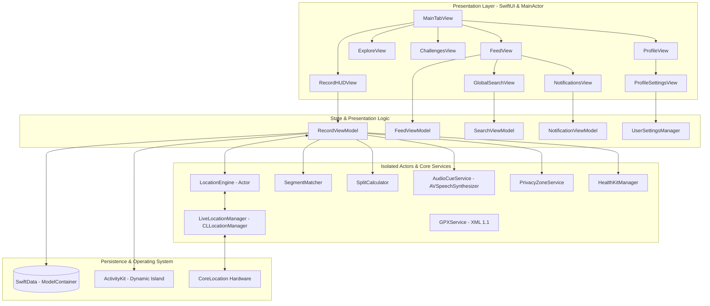

# 🏃‍♂️ StrideSync iOS

<div align="center">

[](https://swift.org)
[](https://apple.com)
[](https://developer.apple.com/xcode/swiftui/)
[](https://developer.apple.com/documentation/swiftdata)
[-brightgreen.svg?style=flat-square)]()
[](LICENSE)

**A high-performance, modern Strava-like fitness tracking and social networking iOS platform built with Swift 6, SwiftUI, SwiftData, CoreLocation Actors, MapKit, and ActivityKit (Dynamic Island).**

[Fitur Utama](#-fitur-utama) • [Arsitektur Teknis](#-arsitektur-teknis) • [Algoritma & Engineering](#-algoritma--engineering) • [Struktur Proyek](#-struktur-direktori-proyek) • [Cara Menjalankan](#-cara-menjalankan-proyek) • [Dokumentasi](#-dokumentasi-lengkap)

</div>

---

## 🌟 Gambaran Umum (Project Overview)

**StrideSync** adalah aplikasi pelacak aktivitas luar ruangan (lari, bersepeda, hiking, dan jalan santai) berbasis iOS yang memadukan keandalan **GPS Engine kelas telemetri** dengan **ekosistem sosial komunitas olahraga**.

Aplikasi ini dibangun dari awal mengadopsi standar arsitektur modern **Swift 6 (Strict Concurrency Checking)**, **SwiftData**, **Actor-based GPS isolation**, dan **Human Interface Guidelines (HIG) iOS 18+**.

---

## 🚀 Fitur Utama (Core Features)

### 1. 🛰️ Pro-Grade GPS & Telemetry Engine
- **Actor-Isolated Location Tracking (`LocationEngine`)**: Mengisolasi proses penerimaan koordinat GPS pada background actor terpisah untuk mencegah *race condition* dan *main-thread blocking*.
- **GPS Noise & Drift Rejection**: Menolak koordinat dengan akurasi horizontal rendah (`> 25 meter`) dan menyaring anomali lonjakan kecepatan.
- **Smart Auto-Pause & Resume**: Otomatis menjeda perekaman saat atlet berhenti di lampu merah (`speed < 0.8 m/s`) dan melanjutkan kembali saat bergerak.
- **Kilometer Splits Calculator**: Menghitung *pacing split* dan akumulasi elevasi secara presisi per kilometer.

### 2. 📱 Dynamic Island & Lock Screen Live Activities
- **ActivityKit Integration**: Menampilkan jarak, durasi bergerak, dan *pace* langsung di Dynamic Island (tampilan *compact* & *expanded*) serta Lock Screen widget saat iPhone terkunci.

### 3. 👑 Virtual Segments & KOM/QOM Leaderboard
- **Spatial Segment Matcher**: Algoritma pencocokan polylines rute terhadap segmen virtual jalanan dengan radius toleransi pintu masuk/keluar (*gate radius* 40m).
- **Crown & Personal Record (PR)**: Penentuan gelar **King/Queen of the Mountain (KOM/QOM)** tercepat dan pemecahan rekor pribadi.

### 4. 🛡️ Geofence Privacy Zones & GPX 1.1 Support
- **Privacy Geofencing**: Menyembunyikan titik awal dan akhir rute dalam radius tertentu (misal 500m di sekitar rumah atau kantor) untuk melindungi privasi atlet pada peta publik.
- **GPX 1.1 XML Generator & Parser**: Ekspor dan impor data rute berstandar internasional lengkap dengan timestamp ISO-8601 dan elevasi.

### 5. 🗣️ Umpan Balik Suara (Audio Voice Cues)
- Sintesis suara native via `AVSpeechSynthesizer` yang mengumumkan *pace split*, total waktu latihan, dan detak jantung dalam Bahasa Indonesia (`id-ID`) atau English (`en-US`).

### 6. 👥 Linimasa Sosial, Pencarian & Notifikasi
- **Community Feed**: Linimasa aktivitas olahraga dengan animasi haptic **Kudos**, kolom komentar, dan *filter chip* multi-kategori.
- **Pusat Notifikasi**: Notifikasi interaktif saat menerima Kudos, komentar, atau saat rekor KOM Anda tergeser oleh atlet lain.
- **Pencarian Global**: Pencarian cerdas lintas 4 dimensi (*Atlet, Aktivitas, Segmen, dan Klub Komunitas*).
- **9:16 Story Card Generator**: Penghasil kartu grafis estetik untuk dibagikan langsung ke Instagram Story.

### 7. 👟 Gear Tracker (Umur Sepatu & Sepeda)
- Memantau akumulasi jarak pemakaian sepatu lari dan sepeda dengan peringatan visual saat mencapai batas umur optimal (500-800 km).

---

## 🏗️ Arsitektur Teknis (System Architecture)

Aplikasi mengadopsi arsitektur **Clean MVVM-C (Model-View-ViewModel-Coordinator)** dengan pembagian batas konkurensi Swift 6:



---

## ⚡️ Algoritma & Engineering Highlights

### 1. Actor-Isolated Telemetry Accumulation
Semua kalkulasi posisi GPS dilakukan di dalam `actor LocationEngine`:
```swift
public actor LocationEngine {
    private var telemetryBuffer: [TelemetrySnapshot] = []
    private var isAutoPaused: Bool = false
    
    public func processLocation(_ location: CLLocation) -> TrackingMetrics {
        guard location.horizontalAccuracy >= 0 && location.horizontalAccuracy <= maxAccuracyThresholdMeters else {
            return currentMetrics()
        }
        // Filtering, Auto-pause evaluation, Distance & Elevation calculation
        ...
    }
}
```

### 2. Segment Polyline Proximity Matching
Mencocokkan titik GPS pengguna dengan gerbang koordinat segmen menggunakan rumus *Haversine Geodesic Distance*:
$$\text{distance}(P_1, P_2) \le R_{\text{gate}} \quad (R_{\text{gate}} = 40.0\text{ m})$$

---

## 📁 Struktur Direktori Proyek

```
Sources/
├── StrideSync/
│   ├── AppMain.swift                    # @main struct StrideSyncApp (iOS Application Entry)
│   ├── StrideSyncApp.swift              # Root View & SwiftData Container configuration
│   ├── Models/
│   │   ├── ActivityType.swift           # Tipe olahraga (Run, Ride, Walk, Hike), Visibility, States
│   │   ├── TelemetryPoint.swift         # Titik GPS SwiftData entity & TelemetrySnapshot (Sendable)
│   │   ├── DistanceSplit.swift          # Model split kilometer + SplitSnapshot
│   │   ├── ActivityRecord.swift         # Entitas SwiftData aktivitas utama + ActivitySummarySnapshot
│   │   ├── Segment.swift                # Model segmen virtual jalanan & leaderboard (KOM/QOM, PR)
│   │   ├── SocialModels.swift           # AthleteProfile, Kudos, Comment, Challenge, GearItem
│   │   ├── UserSettings.swift           # UserSettingsManager (Preferensi, unit, privasi)
│   │   └── NotificationItem.swift       # Model pesan & notifikasi sosial
│   ├── Services/
│   │   ├── LocationEngine.swift         # Actor pengolah GPS real-time & filter noise
│   │   ├── LiveLocationManager.swift    # Bridge CLLocationManager hardware iPhone
│   │   ├── SplitCalculator.swift        # Kalkulator split 1km/mil
│   │   ├── SegmentMatcher.swift         # Algoritma pencocokan segmen jalanan
│   │   ├── AudioCueService.swift        # Voice feedback AVSpeechSynthesizer
│   │   ├── GPXService.swift             # Ekspor/Impor format GPX 1.1 XML
│   │   ├── PrivacyZoneService.swift     # Geofence masking lokasi rumah/kantor
│   │   └── HealthKitManager.swift       # Integrasi Apple HealthKit
│   ├── ViewModels/
│   │   ├── RecordViewModel.swift        # State machine perekaman HUD & live stream
│   │   ├── FeedViewModel.swift          # Linimasa komunitas & interaksi Kudos
│   │   ├── SearchViewModel.swift        # Pencarian global multi-kategori
│   │   ├── NotificationViewModel.swift  # Manajemen inbox notifikasi
│   │   └── ActivityDetailViewModel.swift# Analisis splits & profil elevasi
│   ├── Views/
│   │   ├── Theme/
│   │   │   └── StrideTheme.swift        # Design system, warna oranye atletik & background HIG
│   │   ├── Navigation/
│   │   │   └── MainTabView.swift        # 5-Menu Root TabBar (Feed, Maps, Record, Challenges, You)
│   │   ├── Record/
│   │   │   └── RecordHUDView.swift      # Layar HUD live tracking OLED dark mode
│   │   ├── Summary/
│   │   │   └── ActivitySummaryView.swift# Post-workout breakdown & rute MapKit
│   │   ├── Feed/
│   │   │   ├── ActivityCardView.swift   # Kartu linimasa sosial dengan animasi Kudos
│   │   │   └── FeedView.swift           # Timeline komunitas dengan search & notification sheets
│   │   ├── Explore/
│   │   │   └── ExploreView.swift        # Peta eksplorasi rute & segmen jalanan terdekat
│   │   ├── Challenges/
│   │   │   └── ChallengesView.swift     # Tantangan bulanan dengan progress bar & lencana
│   │   ├── Profile/
│   │   │   ├── ProfileView.swift        # Profil atlet, trophy case & gear tracker
│   │   │   ├── ProfileSettingsView.swift# Master pengaturan akun & preferensi
│   │   │   ├── EditProfileView.swift    # Form edit biodata & metrik fisik
│   │   │   ├── PrivacyZonesSettingsView.swift # Pengaturan radius privasi rumah
│   │   │   ├── AudioCuesSettingsView.swift    # Pengaturan bahasa suara
│   │   │   └── ManageGearView.swift     # Manajemen sepatu lari & sepeda
│   │   ├── Search/
│   │   │   └── GlobalSearchView.swift   # Layar pencarian global atlet, rute & klub
│   │   ├── Notifications/
│   │   │   └── NotificationsView.swift  # Layar pusat notifikasi interaktif
│   │   ├── Share/
│   │   │   └── SocialShareCardView.swift# Generator kartu cerita 9:16 untuk Instagram Story
│   │   └── Segments/
│   │       └── SegmentLeaderboardView.swift # Papan peringkat segmen & mahkota KOM
│   └── LiveActivity/
│       ├── WorkoutActivityAttributes.swift # ActivityKit attributes
│       └── WorkoutLiveActivityWidget.swift # Widget Dynamic Island & Lock Screen
└── StrideSyncDemo/
    └── main.swift                       # Terminal simulation runner
Tests/
└── StrideSyncTests/
    ├── LocationEngineTests.swift        # 2 Tests: GPS noise filtering & tracking state
    ├── SplitCalculatorTests.swift       # 1 Test: 1-km pace split calculation
    ├── SegmentMatcherTests.swift        # 1 Test: Virtual segment matching
    ├── PrivacyZoneTests.swift           # 1 Test: Geofence coordinate masking
    ├── GPXServiceTests.swift            # 1 Test: GPX 1.1 XML export & parse
    ├── LiveLocationManagerTests.swift   # 2 Tests: Hardware delegate bridge & models
    ├── UserSettingsTests.swift          # 1 Test: Settings state & privacy zones
    └── SearchAndNotificationTests.swift # 2 Tests: Search scope filtering & notifications
```

---

## 💻 Cara Menjalankan Proyek (Getting Started)

### Prasyarat
- macOS 14.0+ (Sonoma / Sequoia)
- Xcode 16.0+ (atau Command Line Tools dengan Swift 6.0+)
- iOS Simulator / Perangkat Fisik dengan iOS 18.0+

### 1. Menjalankan Seluruh Unit Test Suite
```bash
swift test
```
*Output: 12 tests across 8 suites passed (100% Passed).*

### 2. Menjalankan Simulasi Live GPS di Terminal
```bash
swift run StrideSyncDemo
```
*Simulasi ini akan mendemokan perekaman 5K lari, filter auto-pause, kalkulasi splits, pencocokan segmen KOM, ekspor GPX, dan feed komunitas.*

### 3. Menjalankan Aplikasi di iOS Simulator
Cukup jalankan script otomatisasi:
```bash
bash build_sim.sh
```
Script ini akan:
1. Mengompilasi aplikasi untuk target `arm64-apple-ios18.0-simulator`.
2. Membuat bundle `StrideSync.app` lengkap dengan `Info.plist` dan izin privasi.
3. Memasang dan meluncurkan aplikasi langsung ke **iOS Simulator** yang aktif.

---

## 📖 Dokumentasi Lengkap (Technical References)

- 📘 [**Product Requirements Document (PRD.md)**](PRD.md) — Dokumen spesifikasi fungsional, persona pengguna, dan roadmap produk.
- 🏛️ [**Architecture Deep Dive (ARCHITECTURE.md)**](ARCHITECTURE.md) — Penjelasan mendalam arsitektur sistem, Actor isolation, dan memory management.
- 🤝 [**Contributing Guide (CONTRIBUTING.md)**](CONTRIBUTING.md) — Panduan kontribusi, standard kode, dan alur Pull Request.

---

## 📄 Lisensi (License)

Proyek ini dirilis di bawah lisensi [MIT License](LICENSE) — Copyright (c) 2026 **[Irs622](https://github.com/Irs622)**.
