# 🚀 StrideSync — Next-Gen Product Roadmap & Technical Enhancement Specification

**Document Version:** 2.0  
**Project:** StrideSync (iOS 18+, Swift 6, watchOS)  
**Status:** Approved for Implementation  
**Focus Area:** Athletic Intelligence, Navigation, Hardware BLE, Live Safety, & Next-Gen Social  

---

## 1. Executive Vision & Expansion Summary

Setelah keberhasilan implementasi **Phase 1 hingga Phase 5** (Core Location Engine, Swift 6 Strict Concurrency, SwiftData V1 Migration, Garmin FIT 2.0 & GPX 1.1, HealthKit, ActivityKit Dynamic Island, dan Geofence Privacy), dokumen ini menetapkan spesifikasi fungsional dan arsitektur teknis untuk **StrideSync v2.0+**.

Peta jalan ini dirancang untuk mengangkat StrideSync dari aplikasi pelacak olahraga *solid MVP* menjadi **platform kebugaran kelas dunia** yang mampu bersaing langsung dengan pemimpin industri seperti *Strava Summit, Garmin Connect, Nike Run Club,* dan *Whoop*.

```mermaid
graph TD
    Root[StrideSync v2.0+ Next-Gen Core]

    Root --> P1[1. Athletic Intelligence & Physiology]
    Root --> P2[2. Live Safety & Route Navigation]
    Root --> P3[3. Hardware & Modern Apple Ecosystem]
    Root --> P4[4. Next-Gen Social & Viral Media]
    Root --> P5[5. Offline Architecture & Multi-Device]

    P1 --> P1_1[Banister TRIMP & Recovery Gauge]
    P1 --> P1_2[Adaptive AI Voice Pacing Coach]
    P1 --> P1_3[Structured Interval Workout Builder]
    P1 --> P1_4[Running Dynamics & Cadence Metronome]

    P2 --> P2_1[Live Safety Beacon Web Share]
    P2 --> P2_2[GPX Turn-by-Turn Navigation]
    P2 --> P2_3[Live Ghost Pacer vs PB/KOM]
    P2 --> P2_4[Incident & Fall Detection]

    P3 --> P3_1[CoreBluetooth External Sensors]
    P3 --> P3_2[Standalone watchOS Companion App]
    P3 --> P3_3[iOS 18 Control Center & Action Button]
    P3 --> P3_4[Interactive Live Activity Actions]

    P4 --> P4_1[3D Animated Route Video Generator]
    P4 --> P4_2[Personal Global Heatmap / Tile Hunter]
    P4 --> P4_3[Live Group Run Buddy Radar]
    P4 --> P4_4[In-App Segment Trimming Tool]

    P5 --> P5_1[Offline Vector Map Tile Caching]
    P5 --> P5_2[CloudKit Multi-Device Sync]
    P5 --> P5_3[Snapshot UI Testing Suite]
```



---

## 2. Rincian Modul & Functional Requirements

### 🧠 Modul 6: Athletic Intelligence & Analisis Fisiologis

#### 6.1 Skor Beban Latihan & Pemulihan (*Training Load & Recovery Advisor*)
* **Algoritma Fisiologis:** Mengimplementasikan model *Banister TRIMP (Training Impulse)* dan konsep *Fitness / Fatigue / Form* (CTL: Chronic Training Load, ATL: Acute Training Load, TSB: Training Stress Balance).
$$\text{TRIMP} = D \times \Delta\text{HR}_{\text{ratio}} \times 0.64\,e^{1.92\,\Delta\text{HR}_{\text{ratio}}}$$
* **Recovery Advisor:** Memberikan kalkulasi jam istirahat yang disarankan sebelum sesi intens berikutnya berdasarkan intensitas HR dan RPE.
* **Metrik Kebugaran:** Indikator kesiapan tubuh harian (*Fresh, Optimal, Overreaching, Fatigued*).

#### 6.2 AI Voice Pacing Coach & Target Split
* **Target-Driven Recording:** Atlet dapat menyetel target lari sebelum mulai (contoh: *Sub-25m 5K* atau *Target Pace 5:15/km*).
* **Dynamic Audio Feedback:** `AudioCueService` membandingkan pace aktual dengan target split per 500m dan memberikan koreksi suara:
  > *"Kamu 4 detik di belakang target pace, tingkatkan cadence sedikit!"*
* **AI Post-Workout Summary:** Generasi narasi ringkasan performa otomatis menggunakan bahasa natural berbasis metrik telemetri yang terkumpul.

#### 6.3 Structured Interval Workout Builder
* **Custom Interval Programming:** Atlet dapat menyusun sesi interval bertingkat:
  * *Warm-up:* 1.0 km (Zona 2)
  * *Main Set:* $5\times (400\text{m Sprint @ Z5} + 200\text{m Jog @ Z1})$
  * *Cool-down:* 1.0 km (Zona 1)
* **Dedicated Interval HUD Mode:** Layar perekaman khusus dengan cincin fase sisa jarak repetisi dan transisi haptic kuat saat perubahan interval.

#### 6.4 Cadence Metronome & Running Dynamics
* **Audio-Haptic Metronome:** Metronom ritmik (160–190 SPM) yang dapat diaktifkan pada earphone/speaker untuk mengunci frekuensi langkah optimal.
* **Sensor Dynamics:** Pengambilan data *cadence* (langkah per menit), *stride length* (panjang langkah), dan *vertical oscillation* via `CoreMotion` accelerometer / pedometer.

---

### 🛰️ Modul 7: Live Safety, Navigasi & In-Run Gamification

#### 7.1 Live Safety Beacon (*LiveTrack / Emergency Sharing*)
* **Real-time Web Link:** Menghasilkan link web terenkripsi satu kali pakai (*one-time token*) yang dapat dibagikan ke kontak darurat via WhatsApp atau SMS.
* **Web Telemetry Stream:** Menampilkan posisi GPS live atlet di peta web, status persentase baterai ponsel, detak jantung saat ini, dan estimasi waktu tiba (*ETA*).
* **Auto-Expire:** Link otomatis hangus saat sesi latihan disimpan atau dibatalkan.

#### 7.2 GPX Route Following & Turn-by-Turn Navigation
* **Course Selection:** Atlet dapat memilih rute dari menu *Explore*, bookmark tersimpan, atau mengimpor file `.gpx` baru.
* **Waypoint Guidance:** Peta HUD menampilkan jalur pemandu dengan overlay arah panah (*"Belok kanan di Jl. Thamrin 60 meter lagi"*).
* **Off-Course Detection:** Peringatan visual dan getaran haptic jika atlet keluar jalur lebih dari 30 meter dari rute yang dipilih.

#### 7.3 Live Ghost Pacer (Berlomba Melawan Rekor / KOM)
* **Real-time Virtual Avatar:** Menampilkan titik pacer (*Ghost*) pada peta HUD yang merepresentasikan rekor waktu terbaik atlet di masa lalu (*PR*) atau pemegang rekor segmen (*KOM/QOM*).
* **Delta Indicator:** Tampilan angka delta real-time (*"+2.4s ahead"* atau *"-1.8s behind"*).

#### 7.4 Incident & Fall Detection (Keamanan Atlet)
* **Sensor Collision Trigger:** Memantau deselerasi mendadak ekstrem diikuti ketiadaan gerakan fisik selama 10 detik via `CMMotionManager`.
* **Safety Countdown HUD:** Memunculkan layar darurat dengan alarm suara dan hitung mundur 30 detik sebelum otomatis mengirim SMS lokasi darurat ke kontak terdaftar.

---

### ⌚️ Modul 8: Ekosistem Hardware & Apple Modern APIs (iOS 18+)

#### 8.1 Dukungan Sensor Bluetooth Eksternal (`CoreBluetooth`)
* **Protokol Standar GATT:**
  * `0x180D` Heart Rate Service (Garmin HRM-Pro, Polar H10, Wahoo TICKR).
  * `0x1816` Cycling Speed and Cadence Service (Sensor ban & pedal sepeda).
  * `0x1818` Cycling Power Service (Power Meter / Wattage & FTP Tracking).
* **Hardware Manager:** Pengaturan koneksi nirkabel Bluetooth, kalibrasi daya, dan indikator status baterai sensor eksternal di halaman Profil.

#### 8.2 Standalone Apple Watch App (`watchOS`)
* **Mandiri Tanpa iPhone:** Perekaman independen di pergelangan tangan menggunakan sensor internal Apple Watch (Optical HR, GPS, Barometer).
* **HealthKit Native Session:** Menggunakan `HKWorkoutSession` dan `HKLiveWorkoutBuilder` agar tidak terhenti oleh sistem background watchOS.
* **Auto-Sync:** Sinkronisasi instan via `WatchConnectivity` (`WCSession`) begitu iPhone dalam jangkauan Bluetooth.

#### 8.3 iOS 18 Control Center Widgets & Action Button (`AppIntents`)
* **ControlWidget:** Tombol *Quick Start Run/Ride* langsung dari Control Center iOS 18.
* **Action Button Integration:** Menyetel tombol Action Button (iPhone 15/16 Pro) untuk instan Start / Pause / Lap Workout via `AppShortcutsProvider`.
* **Siri Voice Shortcuts:** *"Hey Siri, mulai lari pagi 5K di StrideSync"*.

#### 8.4 Interactive Live Activity Actions
* Menambahkan tombol aksi interaktif langsung pada Lock Screen Live Activity (iOS 17/18) untuk **Pause / Resume** dan **Manual Lap Marker** tanpa harus membuka kunci layar.

---

### 👥 Modul 9: Next-Gen Social, Visual Media & Gamifikasi

#### 9.1 3D Animated Route Video Generator (Flyover Reels)
* **Render Animasi 3D:** Menghasilkan video visualisasi rute perjalanan 3D bergerak (15–30 detik) dengan kamera dinamis mengikuti garis elevasi rute.
* **Export Format:** File `.mp4` vertikal 9:16 siap posting ke Instagram Reels, TikTok, atau WhatsApp Status.

#### 9.2 Personal Global Heatmap ("Tile Hunter / Fog of War")
* **Jejak Seumur Hidup:** Visualisasi peta dunia interaktif dengan overlay akumulasi seluruh lintasan rute yang pernah dilalui atlet seumur hidup.
* **Tile Exploration Gamification:** Menghitung persentase kota atau area yang sudah dijelajahi (*"Kamu sudah menjelajahi 14.8% area Jakarta Selatan"*).

#### 9.3 Live Group Runs (Radar Teman Real-time)
* **Peta Teman Sekitar:** Saat berolahraga bersama komunitas atau teman satu klub, titik koordinat anggota yang aktif muncul di peta HUD secara real-time.

#### 9.4 Pembuat Segmen Interaktif (*In-App Segment Trimming*)
* Tool visual dengan dua slider magnetik (*Start Pin & End Pin*) langsung pada layar Detail Aktivitas untuk mengekstrak dan mendaftarkan segmen jalan baru ke komunitas.

---

## 3. Ekstensi Skema Data Model (SwiftData V2 Proposal)

```swift
import Foundation
import SwiftData
import CoreLocation

// MARK: - 1. Training Load & Physiological Models

@Model
final class PhysiologicalMetrics {
    @Attribute(.unique) var id: UUID
    var date: Date
    var trimpScore: Double
    var acuteTrainingLoad: Double // ATL (Fatigue)
    var chronicTrainingLoad: Double // CTL (Fitness)
    var trainingStressBalance: Double // TSB (Form)
    var recoveryTimeHoursRemaining: Double
    var restingHeartRate: Int?
    var hrvScoreMs: Double?
    
    init(
        id: UUID = UUID(),
        date: Date = Date(),
        trimpScore: Double = 0.0,
        acuteTrainingLoad: Double = 0.0,
        chronicTrainingLoad: Double = 0.0,
        trainingStressBalance: Double = 0.0,
        recoveryTimeHoursRemaining: Double = 0.0,
        restingHeartRate: Int? = nil,
        hrvScoreMs: Double? = nil
    ) {
        self.id = id
        self.date = date
        self.trimpScore = trimpScore
        self.acuteTrainingLoad = acuteTrainingLoad
        self.chronicTrainingLoad = chronicTrainingLoad
        self.trainingStressBalance = trainingStressBalance
        self.recoveryTimeHoursRemaining = recoveryTimeHoursRemaining
        self.restingHeartRate = restingHeartRate
        self.hrvScoreMs = hrvScoreMs
    }
}

// MARK: - 2. Structured Workout Plan & Interval

@Model
final class StructuredWorkoutPlan {
    @Attribute(.unique) var id: UUID
    var title: String
    var workoutDescription: String
    var activityType: ActivityType
    var estimatedDurationSeconds: TimeInterval
    @Relationship(deleteRule: .cascade) var steps: [WorkoutStep]
    
    init(
        id: UUID = UUID(),
        title: String,
        workoutDescription: String = "",
        activityType: ActivityType = .run,
        estimatedDurationSeconds: TimeInterval = 0
    ) {
        self.id = id
        self.title = title
        self.workoutDescription = workoutDescription
        self.activityType = activityType
        self.estimatedDurationSeconds = estimatedDurationSeconds
        self.steps = []
    }
}

@Model
final class WorkoutStep {
    var orderIndex: Int
    var stepType: StepType // .warmup, .interval, .recovery, .cooldown
    var targetType: TargetMetricType // .distance, .duration, .heartRateZone, .pace
    var targetValue: Double // e.g. 400 (meters) or 120 (seconds)
    var targetPaceSecondsPerKm: Double?
    var targetHeartRateZone: Int?
    
    init(
        orderIndex: Int,
        stepType: StepType,
        targetType: TargetMetricType,
        targetValue: Double,
        targetPaceSecondsPerKm: Double? = nil,
        targetHeartRateZone: Int? = nil
    ) {
        self.orderIndex = orderIndex
        self.stepType = stepType
        self.targetType = targetType
        self.targetValue = targetValue
        self.targetPaceSecondsPerKm = targetPaceSecondsPerKm
        self.targetHeartRateZone = targetHeartRateZone
    }
}

enum StepType: String, Codable {
    case warmup = "Warm-up"
    case interval = "Interval / Work"
    case recovery = "Recovery / Rest"
    case cooldown = "Cool-down"
}

enum TargetMetricType: String, Codable {
    case distance = "Distance (Meters)"
    case duration = "Duration (Seconds)"
    case openTarget = "Open / Lap Press"
}

// MARK: - 3. Route Course for Navigation

@Model
final class RouteCourse {
    @Attribute(.unique) var id: UUID
    var title: String
    var totalDistanceMeters: Double
    var totalElevationGainMeters: Double
    var gpxDataString: String?
    var isFavorite: Bool
    
    init(
        id: UUID = UUID(),
        title: String,
        totalDistanceMeters: Double,
        totalElevationGainMeters: Double,
        gpxDataString: String? = nil,
        isFavorite: Bool = false
    ) {
        self.id = id
        self.title = title
        self.totalDistanceMeters = totalDistanceMeters
        self.totalElevationGainMeters = totalElevationGainMeters
        self.gpxDataString = gpxDataString
        self.isFavorite = isFavorite
    }
}

// MARK: - 4. BLE Device Connection Profile

public struct BLEDeviceProfile: Identifiable, Codable, Sendable {
    public var id: UUID
    public var deviceName: String
    public var deviceType: BLEDeviceType
    public var peripheralUUIDString: String
    public var batteryLevel: Int?
    public var lastConnectedDate: Date?
    
    public init(id: UUID = UUID(), deviceName: String, deviceType: BLEDeviceType, peripheralUUIDString: String, batteryLevel: Int? = nil, lastConnectedDate: Date? = nil) {
        self.id = id
        self.deviceName = deviceName
        self.deviceType = deviceType
        self.peripheralUUIDString = peripheralUUIDString
        self.batteryLevel = batteryLevel
        self.lastConnectedDate = lastConnectedDate
    }
}

public enum BLEDeviceType: String, Codable, Sendable {
    case heartRateStrap = "Heart Rate Monitor"
    case cyclingCadence = "Cycling Cadence Sensor"
    case cyclingSpeed = "Cycling Speed Sensor"
    case powerMeter = "Power Meter / FTP"
}
```

---

## 4. Matriks Tahapan Eksekusi (Roadmap Execution Schedule)

```
        Q1 (Current)                Q2 (Intelligence)             Q3 (Ecosystem & Safety)           Q4 (Viral Social)
   +--------------------+       +-----------------------+      +-------------------------+      +----------------------+
   |  Phases 1-5 (Done) |  ==>  |  Phase 6:             | ==>  |  Phase 7:               | ==>  |  Phase 8 & 9:        |
   |  • Core GPS Engine |       |  • TRIMP & Recovery   |      |  • Live Safety Beacon   |      |  • BLE Sensors       |
   |  • SwiftData V1    |       |  • Target Pace Coach  |      |  • GPX Navigation       |      |  • 3D Video Flyover  |
   |  • FIT / GPX       |       |  • Interval Builder   |      |  • Fall Detection       |      |  • Global Heatmap    |
   |  • Live Activity   |       |  • Metronome & Cadence|      |  • watchOS App          |      |  • Group Live Radar  |
   +--------------------+       +-----------------------+      +-------------------------+      +----------------------+
```

| Fase | Target Modul & Fitur | Status |
| :--- | :--- | :--- |
| **Phase 1 – 5** | Core Tracking, SwiftData, ActivityKit, HealthKit, Segments, FIT/GPX, Privacy Zones, Keychain | **100% Selesai & Teruji** |
| **Phase 6** | **Athletic Intelligence & Coaching:** Training Load TRIMP, Recovery Gauge, Target Pacing Coach, Cadence & Biomechanics | **100% Selesai & Teruji** |
| **Phase 7** | **Safety, Navigation & Hardware:** Live Safety Beacon, GPX Turn-by-Turn, Ghost Pacer, Fall Detection, watchOS Standalone Engine | **100% Selesai & Teruji** |
| **Phase 8** | **Hardware BLE & Intelligence:** External BLE Sensors (HR & Power), VO2 Max & Race Predictor (5K, 10K, 21K, 42K) | **100% Selesai & Teruji** |
| **Phase 9** | **Viral Media & AI Intelligence:** 3D Route Flyover Video Generator, Personal Global Heatmap, On-Device AI Workout Storyteller | **100% Selesai & Teruji** |

---

## 5. Ringkasan Dampak Terhadap Pengalaman Pengguna (Impact Summary)

1. **Untuk Pelari Kasual:** Menjadi lebih aman dengan *Live Safety Beacon* ke keluarga dan lebih termotivasi dengan *AI Voice Pacer* serta *3D Video Story* yang estetik.
2. **Untuk Atlet Kompetitif / Marathoners:** Memperoleh alat analitik fisiologis standar profesional (*TRIMP, CTL/ATL Training Stress, Structured Intervals, Running Cadence*).
3. **Untuk Komunitas Sepeda & Trail Runners:** Memiliki kepastian navigasi jalur gunung (*GPX Turn-by-Turn, Off-course alert*) dan dukungan perangkat daya (*Power Meters, External BLE sensors*).

---
*Dokumen ini merupakan bagian resmi dari arsitektur dokumentasi repositori StrideSync.*

